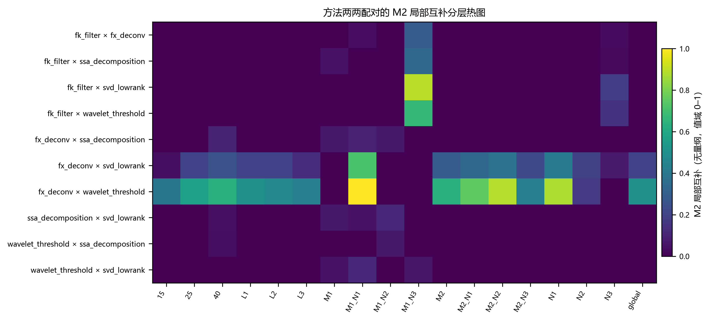
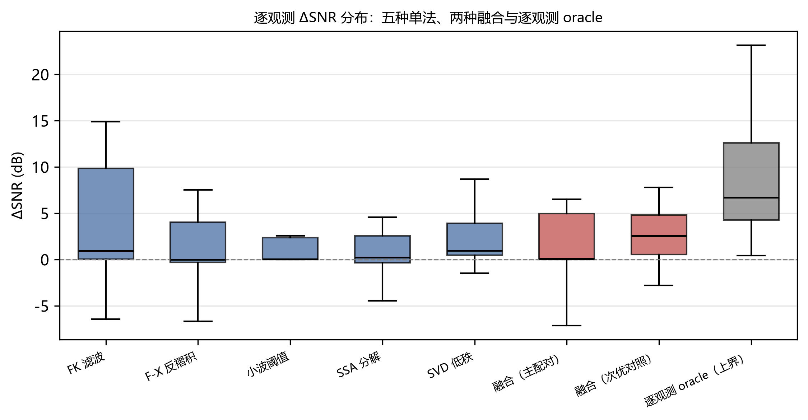

# 预注册基准与互补性分析——附条件性报告的时频融合

*A Pre-Registered Benchmark and Complementarity Analysis of Seismic Denoising Methods, with a Conditionally Reported Time-Frequency Fusion*

**张涛（Zhang Tao）**

---

## 摘要

**背景与问题。** 地震数据去噪方法繁多，但跨方法可比性长期缺失：各方法在不同数据、指标与调参预算下报告结果，读者难以判断某种方法是否真正更优。

**方法。** 本文提出并执行一套**预注册去噪基准**——判据、配置、随机种子与评估面板在观察任何方法输出之前冻结，主配对的选择规则同样预先确定；评估框架由信噪比增益、真值事件窗泄漏指标、相干噪声抑制指标与事件级指标构成。在此基础上定义误差正交性、局部互补与频带互补三种跨方法互补性度量，并按预注册规则实现时频加权融合。

**数据。** 合成部分覆盖 2 套速度模型 × 3 类噪声 × 3 个强度档位 × 3 个主频、每组合 5 个独立随机种子，共 54 个配置、270 个观测；野外部分使用三个冻结面板。

**结果。** 主配对融合的信噪比增益中位数为 0.0588 dB，低于最优固定单法的 0.9482 dB；预注册的稳健性对照融合为 2.5295 dB，高于全部五种固定单法；逐观测 oracle 的 6.7033 dB 需要真值，仅为上界。**野外部分给出负结果**：两个可计算面板上，融合的综合部分分均低于同面板最佳单法（−2.2100 对 +0.6953；−1.0791 对 +0.6359），第三个面板因未检出事件窗而不可计算。

**结论。** 本文的主要贡献是基准与互补性度量学本身；融合按条件性评估报告——在本文边界内未被任何最差单法击败、亦未出现失效，但未超越最优固定单法，且在野外不优于单法。事后探索显示误差正交性度量对融合增益具有正向预测性、而局部互补度量没有；该差异为事后探索性分析，不进入主结论。

## 关键词

地震去噪；预注册基准；方法可比性；互补性度量；时频融合；可复现性

---

## 1 引言

### 1.1 问题

地震数据去噪方法种类繁多，涵盖滤波、变换域阈值、分解、低秩逼近与深度学习方法。然而跨方法的可比性长期缺失：不同研究在不同数据、不同指标与不同调参预算下报告结果，读者难以判断某种方法是否真正优于另一种。这一困难并非工程细节，而是评价体系的结构性问题——当判据、数据划分与调参预算均可事后调整时，任何方法的优势都难以被独立检验。

### 1.2 现有工作的不足

现有多方法对比工作通常具备两项共同特征：其一，方法集合与评价指标在结果可见之后确定；其二，对比范围限于少数方法，且缺少对方法之间**信息关系**的刻画。前者使结论难以排除选择效应，后者使"多种方法为何互补"这一问题缺乏可量化的入口。综述与基准类工作在方法覆盖上较为完整，但同样较少把判据与选择规则在结果之前固定下来。

在相邻方向上，近期工作已就学习类去噪方法在时域、时频域与混合域之间开展受控比较[5]；卷积神经网络用于地震噪声衰减的对比分析[6]，以及面向沙漠数据的多尺度特征交互增强网络[7]，同样报告了以单方法为主导的对比结果。这些工作共同表明多方法对比研究已具规模，而其方法集合与评价指标多在结果可见之后确定。

### 1.3 本文贡献

本文提出并执行如下三条贡献。

其一，**预注册去噪基准**：判据、配置、随机种子与评估面板在观察任何方法输出之前冻结，主配对的选择规则同样预先确定，从而使本研究的结论不含事后选优。

其二，**信号保真评估框架与跨方法互补性度量学**：在信噪比增益与真值事件窗泄漏指标之外，引入相干噪声抑制指标与事件级指标；并定义误差正交性、局部互补与频带互补三种度量，用以刻画方法两两之间的信息关系，其中局部互补度量配有预注册的池化阈值判据。

其三，**条件性报告的时频加权融合**：按预注册规则实现融合，并对其结果作条件性报告。融合未被任何最差单法击败，亦未出现失效；但未超越最优固定单法。预注册的稳健性对照配对的结果见第 4.3 节。

### 1.4 论文结构

第 2 节介绍合成数据生成与野外数据来源；第 3 节给出五种基线方法、评价指标、互补性度量、融合方法与评估协议；第 4 节报告合成基准、互补性与融合结果；第 5 节讨论度量分歧的含义、融合未获益的机理与适用边界；第 6 节总结。

---

## 2 研究区与数据

### 2.1 合成数据

合成数据由两套速度模型驱动：水平层状模型与含倾斜—弯曲—断层模型。噪声设置包含三类：带限随机噪声、线性相干干扰与频散面波。参数网格为 2 套模型 × 3 类噪声 × 3 个强度档位 × 3 个主频，每组合取 5 个独立随机种子，构成 54 个配置、270 个观测。噪声强度以**实测输入信噪比**为规范口径对外报告，振幅比例仅用于生成实现。各维度的取值与选法如下表。

**表 1** 合成配置的模型、噪声与档位定义

| 维度 | 取值 | 选法与说明 |
| :--- | :--- | :--- |
| 速度模型 | M1 水平层状；M2 含倾斜—弯曲—断层 | 覆盖层状与构造两类主要情形 |
| 噪声类型 | N1 带限随机；N2 线性相干干扰；N3 频散面波 | N2 为视速度可控的相干干扰，在道间引入可预测的线性同相轴 |
| 强度档位 | L1 / L2 / L3 | N1 与 N3 经振幅比例 0.30 / 0.60 / 1.00 生成，对应实测输入信噪比 10.46 / 4.44 / 0.00 dB；N2 不接受振幅比例，其档位由视速度槽位承担，依次为 800 / 1500 / 3000 m/s |
| 主频 | 15 / 25 / 40 Hz | 覆盖低频至中频段 |
| 随机种子 | 每组合 5 个独立种子 | 用于区分观测间变异与配置间差异 |

### 2.2 野外数据

野外数据取自公开的 Martha's Vineyard 与 Nantucket 陆上—近海淡水系统地震调查数据集，采用 CC BY 4.0 许可，其引文为：

> Dugan, B. (2023). *Seismic and Hydrostratigraphic Characterization of the Onshore-Offshore Freshwater Systems of Martha's Vineyard and Nantucket, Massachusetts, USA: Field Survey Report* [Data set]. Zenodo. https://doi.org/10.5281/zenodo.10407771

本文使用其中三个冻结面板：FP1（Nantucket 测区）、FP2 与 FP3（Martha's Vineyard 测区），覆盖两个测区（图 1）。面板的选取依一组事先冻结的判据排序确定，不依据任何去噪结果。FP3 在冻结的阈值下未检出事件窗，该情形按预先声明的确定性回退阶梯处理。

**图 1** 野外三面板原始记录预览。(a) FP1（Nantucket 测区）；(b) FP2（Martha's Vineyard 测区）；(c) FP3（Martha's Vineyard 测区）。横轴为道号（无量纲）；纵轴为双程走时（ms）；色标为振幅（无量纲）。

---

## 3 方法

### 3.1 基线方法

本文选取五种确定性去噪方法，覆盖四类必须的机制类别。

**滤波类。** F-K 滤波在频率—波数域利用视速度差异压制线性干扰与频散面波；F-X 反褶积在同一频率—空间道集上做横向预测，压制可预测的相干能量，其思想来源于横向预测噪声衰减方法[1]。

**变换域阈值类。** 小波阈值方法在时间—尺度域分离信号与噪声，广泛用于压制地滚波等相干噪声[2]。

**分解类。** 阻尼多道奇异谱分析把多道数据组织为轨迹矩阵并做低秩重构，用于三维随机噪声压制[3]。

**低秩类。** 经验低秩逼近通过构造相似的块矩阵并施加低秩约束实现噪声衰减[4]。

上述五种方法的实现均为确定性映射，不接受随机成分。需要说明的是，跨域预训练深度网络因需改变冻结的评估环境而未纳入本文方法集合，这一情形在方法覆盖上构成一项明确限制。

**调参政策。** 所有方法参数一律采用登记表中的默认值，在本研究中不做逐方法调参。理由是：逐方法调参会使各方法的比较建立在其各自最优而非其默认行为之上，等价于逐方法引入选择效应。协议未指定的参数登记为方法级默认值，并随配置一并冻结；若须改动，先改登记表、后改实现。

**表 2** 基线方法的关键参数与来源

| 方法 | 类别 | 关键参数（取值） | 参数来源 |
| :--- | :--- | :--- | :--- |
| F-K 滤波 | 滤波 | 视速度截断 800.0 m/s；频带 5.0–80.0 Hz | 截断为方法级默认；频带取自冻结配置 |
| F-X 反褶积 | 滤波 | 预测阶数 4；频带 5.0–80.0 Hz；岭正则 1e-08 | 阶数与正则为方法级默认；频带取自冻结配置 |
| 小波阈值 | 变换阈值 | 小波 db4；软阈值；阈值倍数 1.0；层数自动 | 全部为方法级默认 |
| 分解（多道奇异谱分析） | 分解 | 嵌入维 64；分量数 8 | 方法级默认 |
| 低秩（经验低秩逼近） | 低秩 | 秩自动（能量占比 0.95） | 方法级默认 |

### 3.2 评价指标

**信噪比增益。** 以干净记录为 $s$、含噪输入为 $x$、方法输出为 $y$，定义

$$
\Delta\mathrm{SNR} = 10\log_{10}\frac{\lVert x-s\rVert^{2}}{\lVert y-s\rVert^{2}} \qquad (1)
$$

单位为 dB，数值越高表示去噪越充分。该指标刻画整体能量意义上的误差削减。

**真值事件窗泄漏。** 设 $\mathcal{W}$ 为真值事件窗集合，泄漏指标定义为输出在事件窗内的相对误差能量：

$$
L_{\mathrm{sig}} = \frac{\sum_{w\in\mathcal{W}}\lVert (y-s)\rVert_{w}^{2}}{\sum_{w\in\mathcal{W}}\lVert s\rVert_{w}^{2}} \qquad (2)
$$

单位为无量纲比值，数值越低表示对有效信号的保真越好。该指标与信噪比增益方向相反：前者奖励误差总能量的削减，后者惩罚有效信号所在窗内的误差。在本研究中，两者并不总是同向变化——主配对融合相对其成员之一提高了信噪比增益（0.0588 dB 对 0.0422 dB），同时使泄漏指标变差（0.020640 对 0.015129）；相对最优固定单法则在两个指标上同时更差（0.0588 dB 对 0.9482 dB；0.020640 对 0.011218）。因此，单一指标不足以判定去噪质量，本文对两者一并报告。

**相干噪声抑制。** 设 $n_{c}$ 为已知注入的相干噪声，$P_{\mathcal{C}}$ 为向由注入分量基张成的子空间的最小二乘投影，则

$$
\mathrm{CNA} = 10\log_{10}\frac{\lVert n_{c}\rVert^{2}}{\lVert P_{\mathcal{C}}(y-s)\rVert^{2}} \qquad (3)
$$

单位为 dB，越高越好。需要明确其作用域：该指标的投影子空间与注入参数同源，衡量的是对**该注入成分**的抑制，不代表对任意相干噪声的普适评价。

**事件级指标。** 对输出与真值各取解析信号包络，在真值事件窗内定位包络峰值，定义到时误差为二者峰值位置之差：

$$
\Delta t_{\mathrm{event}} = \left| t_{\mathrm{peak}}(y) - t_{\mathrm{peak}}(s) \right| \qquad (4)
$$

单位为 ms；同时计算窗内归一化能量误差 $\left| E_{y}-E_{s}\right|/E_{s}$，报告其中位数与最大值。

### 3.3 互补性度量

**误差正交性。** 设 $e_{i}$、$e_{j}$ 为两方法在同一观测上的误差向量。取绝对值会掩盖误差相关的**方向**——反相关的误差对取平均反而有利，而正相关的误差对取平均不利——因此本文同时定义不带绝对值的形式，作为分析性补充：

$$
O_{ij} = 1 - \frac{\left|\langle e_{i}, e_{j}\rangle\right|}{\lVert e_{i}\rVert\,\lVert e_{j}\rVert}, \qquad
O^{\mathrm{s}}_{ij} = 1 - \frac{\langle e_{i}, e_{j}\rangle}{\lVert e_{i}\rVert\,\lVert e_{j}\rVert} \qquad (5)
$$

其中 $O^{\mathrm{s}}_{ij}$ 值域为 $[-1,1]$，取正值表示误差反相关（互补），取负值表示误差正相关（冗余）。

**局部互补。** 对每个窗计算两方法窗内保真度之差，并将其绝对量与"该对差值的池化四分位距 × 1.5"相比较：

$$
C_{ij} = \frac{\#\left\{ w : \left| D_{ij}(w) \right| > 1.5\,\mathrm{IQR}\!\left( D_{ij} \right) \right\}}{\#\left\{ w \right\}} \qquad (6)
$$

其中 $D_{ij}(w)$ 为两方法在窗 $w$ 上的保真度之差，$\mathrm{IQR}$ 在整对窗集合上池化计算，故每个配对对应一个固定阈值常数。值域为 $[0,1]$。

**频带互补。** 将误差谱划分为五个频带并归一化为概率分布 $p$、$q$，定义

$$
B_{ij} = \frac{1}{2}\sum_{k} p_{k}\,\log_{2}\frac{p_{k}}{m_{k}}
+ \frac{1}{2}\sum_{k} q_{k}\,\log_{2}\frac{q_{k}}{m_{k}}, \qquad
m = \frac{p + q}{2} \qquad (7)
$$

即两分布之间的 base-2 Jensen–Shannon 散度，值域为 $[0,1]$。**更正说明**：本文初稿把该式写作两个分布之间的对称化 KL 组合，与预注册定义及实现均不一致；此处按预注册定义（混合分布 $m$ 形式）更正。该错误为**本文撰写时的转录错误**，预注册件与实现自始一致，且该度量不参与配对选择，故不影响主配对结论。

**配对选择规则。** 主配对按 $C_{ij}$ 的全局中位数降序确定，取最高者；若出现并列则按预定次序打破。该规则在任何融合结果可见之前写入评估配置并冻结。

**表 3** 符号表

| 符号 | 含义 | 单位或值域 |
| :--- | :--- | :--- |
| $s$ | 干净记录（真值） | 振幅（无量纲） |
| $x$ | 含噪输入 | 振幅（无量纲） |
| $y$，$y_{i}$，$y_{j}$ | 方法或融合的输出 | 振幅（无量纲） |
| $e_{i}$ | 方法 $i$ 的误差，$y_{i}-s$ | 振幅（无量纲） |
| $\mathcal{W}$ | 真值事件窗集合 | — |
| $n_{c}$ | 注入的相干噪声分量 | 振幅（无量纲） |
| $\Delta\mathrm{SNR}$ | 信噪比增益，式 (1) | dB |
| $L_{\mathrm{sig}}$ | 真值事件窗泄漏，式 (2) | 无量纲 |
| $\mathrm{CNA}$ | 相干噪声抑制，式 (3) | dB |
| $O_{ij}$，$O^{\mathrm{s}}_{ij}$ | 误差正交性（不带 / 带符号），式 (5) | $[0,1]$ / $[-1,1]$ |
| $C_{ij}$ | 局部互补，式 (6) | $[0,1]$ |
| $B_{ij}$ | 频带互补，式 (7) | $[0,1]$ |
| $w_{i}$ | 融合初始权重，式 (8) | $[0,1]$ |
| $s_{i}$ | 融合鉴别分，式 (9) | $[0,1]$ |
| $\gamma$ | 权重压制系数，式 (10) | 0.4 / 0.5 / 0.6 |

### 3.4 融合方法

融合在短时傅里叶域逐系数进行。设两方法输出为 $y_{i}$、$y_{j}$，各自计算横向相干度 $C_{i}$、$C_{j}$（仅由该输出自身确定），权重为

$$
w_{i} = C_{i}^{2}, \qquad w_{j} = C_{j}^{2} \qquad (8)
$$

随后计算逐窗鉴别分 $s_{i}$，它由视速度差、带宽差与振幅差三个子分加权构成：

$$
s_{i} = \mathrm{clip}\!\left( 0.4\,d + 0.3\,b + 0.3\,a,\; 0,\; 1 \right) \qquad (9)
$$

其中 $d$ 以视速度下限 $v_{\mathrm{lo}} = 100.0$ m/s 归一化。最终权重按下式压制：

$$
w_{i}' = w_{i}\left( 1 - \gamma\, s_{i} \right), \qquad \gamma \in \{0.4,\ 0.5,\ 0.6\} \qquad (10)
$$

重建时对权重作逐系数归一化；当两方法权重同时为零时，退化为等权平均。融合函数的形式参数仅包含两方法输出与参数表，不含真值，该约束由语法层检查强制。

该设计包含三条防止"一致即正确"误判的机制：其一，权重 $w$ 不含任何跨方法比较项；其二，一致性只进入鉴别分 $s$，而 $s$ 只用于**降低**权重；其三，一致性子分在 $s$ 中占比仅 0.3。三者共同保证"两方法结果一致"无法在数学上兑换为更高的可信度。

### 3.5 评估协议

判据与阈值在任何评估运行之前预注册。主配对与稳健性对照配对均按第 3.3 节的规则预先确定；三个 $\gamma$ 档位全部报告，不选择性呈现。统计比较采用配对符号翻转置换检验与 Holm 多重比较校正，并以自助法给出置信区间；三个档位的语义为：$\gamma$ 越大，权重压制越强、结果越保守。

**统计的单位与聚类口径。** 270 个观测来自 54 个配置，每个配置含 5 个随机种子。同一配置内的观测共享模型、噪声类型、强度档位与主频，其误差**不相互独立**；因此凡涉及配置间比较的统计量，均以**配置为单位**（$n = 54$）进行聚类或聚合，而非按 270 个观测直接计数。观测量 $n = 270$ 仅用于描述性统计与逐观测分布展示。这一口径适用于本文全部显著性陈述。

野外评估使用四项无参考指标（振幅保持、频谱残差、同相轴连续性、由不知晓方法标签的评分者进行的差异剖面结构化判读），其权重为 30/25/25/20。

同相轴连续性指标在计算之前经过三项预先声明的可区分性判据检验：倾角对齐优于零延迟增益大于 0.1、三面板极差大于 0.05、打乱道序降幅大于 0.1。实测值为 0.0503、0.0790 与 0.0838，均未达阈值，故该指标在本文数据集上不可区分，按预先声明将其从综合评分中剔除并将权重重新归一化为 0.4000、0.3333 与 0.2667。阈值未作放宽。

需要说明该项检验的**不对称性**：三项判据的达标程度并不一致。方向性判据（倾角对齐、打乱道序）表现较强，其实测值已接近但未越过阈值；而三面板极差判据明显更弱（0.0790 对阈值 0.05 的超出幅度小于另两项相对 0.1 的差距）。因此本文的结论应表述为「在本数据集与本文阈值下不可区分」，而非「该指标本身无区分能力」。

---

## 4 结果

### 4.1 合成基准

表 4 给出五种方法在 270 个观测上的信噪比增益与泄漏指标中位数。F-K 滤波与低秩方法在信噪比增益上接近，分别为 0.9320 dB 与 0.9482 dB；F-X 反褶积的信噪比增益中位数为 0.0000 dB，但其泄漏指标为 0.029151，处于中等水平；小波阈值与分解方法的增益分别为 0.0422 dB 与 0.2101 dB。泄漏指标最低者为 F-K 滤波（0.009706），最高者为分解方法（0.045928）。

**表 4** 五种方法在 270 个观测上的宏平均中位数

| 方法 | ΔSNR (dB) | Lsig (无量纲) |
| :--- | ---: | ---: |
| F-K 滤波 | 0.9320 | 0.009706 |
| F-X 反褶积 | 0.0000 | 0.029151 |
| 小波阈值 | 0.0422 | 0.015129 |
| 分解方法 | 0.2101 | 0.045928 |
| 低秩方法 | 0.9482 | 0.011218 |

图 2 以误差棒形式给出各方法的中位数与自助 95% 置信区间，可见方法间的差异量级远小于观测间差异的量级。

**图 2** 五种方法在 270 个观测上的 ΔSNR 中位数与自助 95% 置信区间。横轴为方法；纵轴为 ΔSNR（dB）；误差棒为 95% 置信区间；标注值为中位数（dB）。

### 4.2 互补性

互补性度量在 10 个方法配对、3 种度量与 18 个分层键上共产生 540 条记录。按预注册规则，局部互补度量的全局中位数最高者为主配对，取值 0.500000，无并列；次名取值为 0.200000。

三项度量之间存在一处需要明确陈述的分歧。局部互补度量在 10 个配对中有 8 个的全局中位数为 0.000，呈显著零膨胀；而按该度量选出的主配对，其误差正交性取值 0.093807，为全部 10 个配对中的最低值，对应归一化内积约 0.906，即两方法误差近乎共线；局部互补的次名配对，其误差正交性为 0.575710，明显更高。因此，误差正交性与局部互补度量指向了不同的配对。

按预注册规则，配对选择绑定于局部互补度量，不作更改。该分歧本身作为一项度量学发现予以保留：它表明两种度量对“互补”的刻画并不等价，且其差异在融合结果中具有可观察的后果（见第 4.3 节）。

**度量的预测力（事后探索性分析，$n = 10$，配对不独立）。** 把融合运行扩展到全部 10 对之后，可以检验各度量对融合增益的秩相关。**M1 正向**：误差正交性在 5 种增益定义中有 4 种与融合增益正相关，即它预测的是一种**向 oracle 的恢复程度**；**M1 不预测击败较强成员**：当增益定义为「融合相对两成员中较强者的差值」时，秩相关反转为负，说明正交性高往往意味着其中一员本身已经足够强；**M2 无预测力**：局部互补度量在任何一种增益定义下都未表现出正向预测性。

**增益定义与口径并列（两种口径均列出，不合并、不择优）。** 秩相关对增益定义敏感，因此两种口径均列出如下：

**表 5** 各度量全局值与融合增益的秩相关（$n = 10$，事后探索性分析）

| 增益定义 | 口径说明 | M1 | M1（带符号） | M2 | M3 |
| :--- | :--- | ---: | ---: | ---: | ---: |
| 定义 A（本文最初所用） | 融合自身 ΔSNR 的中位 | +0.8303 | +0.8303 | −0.3114 | +0.6242 |
| 定义 B | 融合相对最优固定单法的中位差 | +0.4909 | +0.4909 | −0.5449 | +0.5030 |
| 定义 C | 融合相对两成员中较强者的中位差 | −0.7091 | −0.7091 | +0.0432 | −0.3455 |
| 定义 D（独立复算口径） | 融合相对逐观测 oracle 的中位差 | +0.6727 | +0.6727 | −0.0779 | +0.5030 |
| 定义 E | 融合自身 ΔSNR 的均值 | +0.7939 | +0.7939 | −0.1384 | +0.4545 |

> 说明：上表秩相关统一采用并列平均秩。定义 A 与定义 D 的差别同时来自增益口径与秩的处理方式，两种口径均由独立实现复算核对。**幅度随定义明显变化，方向则大体稳定**（M1 除定义 C 外均为正，M2 无一为正）——这正是 $n = 10$ 且配对不独立时不宜过度解读的直接证据。全部数值标注为事后探索性分析，不进入主结论。

局部互补度量的取值在分层间高度不均匀。以主配对为例，其在模型分层与面波噪声分层上的取值均为 0.0000，而在"水平层状模型 × 带限随机噪声"分层上达到 1.0000。分层样本量介于 45 与 135 之间，属小样本分数，其证据强度依赖模型与噪声类型，不可跨层外推。图 3 给出局部互补度量的分层热图，图 4 给出两种度量的全局矩阵。

**图 3** 方法两两配对的局部互补度量分层热图。横轴为分层键；纵轴为方法配对；色标为局部互补取值（无量纲，值域 0–1）。

**图 4** 两种互补性度量的全局矩阵（270 个观测中位数）。左：误差正交性；右：局部互补。色标值域 0–1（无量纲）。

### 4.3 融合与 oracle 定位

融合共运行 1620 个网格单元，无失败。三个 $\gamma$ 档位在主配对上的结果在四位小数上完全相同，说明该参数在本数据结构下未产生可测差异；其机理在第 5.2 节讨论。

**配对清单与规则透明化。** 五种方法两两组合共 10 对，全部列出如下，不做选择性呈现。其中主配对与稳健性对照配对由第 3.3 节的预注册规则在三档 $\gamma$ 之前确定。

**表 6** 方法两两配对清单（共 10 对）、互补性度量与预注册角色

| # | 配对 | 局部互补（全局中位） | 误差正交性（全局中位） | 融合 ΔSNR 中位 (dB) | 预注册角色 |
| ---: | :--- | ---: | ---: | ---: | :--- |
| 1 | F-K 滤波 × F-X 反褶积 | 0.000000 | 0.741185 | 4.1515 | — |
| 2 | F-K 滤波 × 小波阈值 | 0.000000 | 0.194905 | 1.9431 | — |
| 3 | F-K 滤波 × 分解 | 0.000000 | 0.575360 | 2.7600 | — |
| 4 | F-K 滤波 × 低秩 | 0.000000 | 0.576086 | 3.2659 | — |
| 5 | F-X 反褶积 × 小波阈值 | 0.500000 | 0.093807 | 0.0588 | **主配对（预注册）** |
| 6 | F-X 反褶积 × 分解 | 0.000000 | 0.423203 | 0.4240 | — |
| 7 | F-X 反褶积 × 低秩 | 0.200000 | 0.575710 | 2.5295 | **稳健性对照（预注册）** |
| 8 | 小波阈值 × 分解 | 0.000000 | 0.268651 | 0.5095 | — |
| 9 | 小波阈值 × 低秩 | 0.000000 | 0.157471 | 1.8038 | — |
| 10 | 分解 × 低秩 | 0.000000 | 0.406879 | 2.0455 | — |

> 说明：前四列为预注册度量的全局中位；**末列为事后扩展分析**（把融合运行从预注册的两对扩展到全部 10 对）所得，标注为探索性，不参与配对选择，也不改变预注册结论。

**关于两处规则细节的说明。** 其一，主配对与稳健性对照配对**不接受**任何形式的选择性替换：配对集合、选择规则与两对角色均在结果可见之前写入配置。其二，三个 $\gamma$ 档位（0.4、0.5、0.6）全部报告：$\gamma$ 越大，权重压制项 $1-\gamma s$ 越强、融合越保守。

**表 7** 融合、其两成员与固定单法的信噪比增益与泄漏指标中位数（$\gamma = 0.5$）

| 项目 | ΔSNR (dB) | Lsig (无量纲) |
| :--- | ---: | ---: |
| 融合（主配对 = F-X 反褶积 × 小波阈值） | 0.0588 | 0.020640 |
| 　其成员 A：F-X 反褶积 | 0.0000 | 0.029151 |
| 　其成员 B：小波阈值 | 0.0422 | 0.015129 |
| 融合（稳健性对照 = F-X 反褶积 × 低秩） | 2.5295 | 0.018103 |
| 　其成员 A：F-X 反褶积 | 0.0000 | 0.029151 |
| 　其成员 B：低秩 | 0.9482 | 0.011218 |
| 逐观测 oracle（上界，不可部署） | 6.7033 | — |
| 最优固定单法（低秩） | 0.9482 | 0.011218 |
| 次优固定单法（F-K 滤波） | 0.9320 | 0.009706 |

**主配对融合未击败任何固定单法。** 其信噪比增益中位数 0.0588 dB 低于低秩方法的 0.9482 dB 与 F-K 滤波的 0.9320 dB。

**稳健性对照融合击败全部五种固定单法。** 其信噪比增益中位数 2.5295 dB 高于全部单法。

将两个融合结果分别与"最差单法"比较，结果为：信噪比增益方向上，融合相对最差单法（F-X 反褶积，取最小值）的中位差为 +0.054257 dB，Holm 校正后显著性水平为 0.134687；泄漏指标方向上，融合相对最差单法（分解方法，取最大值）的中位差为 −0.017167，Holm 校正后显著性水平为 0.00019998。两者的置信区间均不包含零。两个指标的最差单法并非同一个方法：由于二者方向相反，信噪比增益方向取最小值，而泄漏指标方向取最大值。据此，融合未被任何最差单法击败，两指标同时被击败的情形不成立。

**相干噪声抑制与事件级指标。** 下表直接列出三项指标的实测中位数，不作定性结论。需要说明口径：相干噪声抑制指标（CNA）仅在含可辨识相干分量的配置上可算，即线性相干干扰与频散面波两类，共 180 个观测；带限随机噪声配置无相干分量，该指标记为不适用。

**表 8** 相干噪声抑制与事件级指标的中位数

| 项目 | CNA (dB) | 事件到时误差 (ms) | 窗内归一化能量误差 | 可算观测数 |
| :--- | ---: | ---: | ---: | ---: |
| F-K 滤波 | 14.6916 | 0.00 | 0.010799 | 180 |
| F-X 反褶积 | 0.0571 | 0.00 | 0.038997 | 180 |
| 小波阈值 | 0.0182 | 0.00 | 0.017392 | 180 |
| 分解 | 2.0804 | 2.00 | 0.071400 | 180 |
| 低秩 | 6.7747 | 0.00 | 0.015202 | 180 |
| 融合（主配对） | 0.1101 | 0.00 | 0.035038 | 540 |
| 融合（稳健性对照） | 2.8370 | 0.00 | 0.032294 | 540 |

> 融合行的可算观测数为 540（180 个含相干分量的观测 × 3 个 $\gamma$ 档位）。CNA 的投影子空间与注入参数同源，衡量的是对该注入成分的抑制，不代表对任意相干噪声的普适评价。

**逐观测 oracle 是上界而非可达基线。** 逐观测 oracle 在每个观测上选取信噪比增益最高的单法，其宏平均中位数为 6.7033 dB。该数值必然不低于任何固定方法的逐观测最优，且其构造需要真值，在现实中不可实现。它与固定配对融合存在本质区别：固定配对一次选定、全观测通用，是可部署的；oracle 逐观测依真值择法，不可部署。因此，融合与 oracle 之间的差距不应表述为融合失败，而应表述为：融合未达到不可达上界，且主配对未超越最优固定单法。图 5 给出逐观测信噪比增益的箱线图对比。

**图 5** 逐观测 ΔSNR 分布（箱线图）。依次为五种固定单法、主配对融合、稳健性对照融合与逐观测 oracle。纵轴为 ΔSNR（dB）；箱体为四分位距，横线为中位数，须线为 1.5 倍四分位距内的极值。

### 4.4 野外评估

野外评估在三个冻结面板上进行，综合评分为部分分（同相轴连续性按第 3.5 节剔除；差异剖面结构化判读未纳入）。FP1 的融合评分为 −2.2100，同面板最佳单法为 +0.6953；FP2 的融合评分为 −1.0791，最佳单法为 +0.6359。**两个可计算面板上，融合均低于同面板最佳单法。**

FP3 不可计算，其口径统一说明如下：事件窗由冻结的阈值系数 3.0（稳健中位绝对偏差的倍数）确定，在该阈值下 FP3 检出 **0 个**事件窗；预先声明的回退阶梯会把阈值降到 2.5，但该档位选定的 3 个事件窗**未被记录进冻结件**，因而不可复现。故本文对 FP3 一律记为不可计算，**不以任何替代阈值或全窗数值回填**。依赖事件窗的指标在 FP3 上同样记为不可计算，不参与综合评分。

**表 9** 野外面板评估结果

| 面板 | 融合（部分分） | 最佳单法（部分分） | 说明 |
| :--- | ---: | ---: | :--- |
| FP1 | −2.2100 | +0.6953 | 事件窗 1 个 |
| FP2 | −1.0791 | +0.6359 | 事件窗 3 个 |
| FP3 | 不可计算 | 不可计算 | 事件窗 0 个 |

---

## 5 讨论

### 5.1 度量分歧的含义

误差正交性与局部互补度量对同一批数据给出了不一致的配对偏好。本文**不将这一分歧解释为某一度量失效**，因为两者刻画的是误差结构的不同侧面，且本研究的样本量不足以判定何者更优。可以确定的是：前者对误差向量的整体相关性敏感，对全局共线尤为敏感；后者的阈值判据在零膨胀与小样本分层下趋于保守——在主配对上，10 个配对中有 8 个的全局中位为 0，而选中对的阈值（0.0394653）又是 10 对中最严的一个，这使得该度量在选出主配对的同时也倾向于给出偏低的取值。

由此可以给出一个**机制层面**的说明（而非因果结论）：局部互补的低取值既可能来自真实的方向性差异，也可能部分来自阈值构造与零膨胀的相互作用。互补性度量的选择因此是建模决定，而非中立的测量。其中「某种度量预测到融合增益、另一种没有」这一读法属事后探索性分析，不进入主结论。

### 5.2 融合未获益的机理

三个 $\gamma$ 档位的结果在四位小数上相同，其原因可通过鉴别分的构成解释。视速度子分 $d$ 以 100.0 m/s 为归一化下界，而实际视速度远高于该值，故 $d$ 恒为零；带宽子分 $b$ 由两方法的带宽共同决定，二者在本文数据上近似相等；振幅子分 $a$ 为对称定义。三者相加使得两方法的鉴别分近似相等，即 $s_{i} \approx s_{j}$，于是权重压制因子 $1 - \gamma s$ 在逐系数归一化中被近似约去。因此，$\gamma$ 并未构成对"过平滑"失效模式的有效对冲。这一结果修正了设计阶段的假设，并说明一致性加权的有效性依赖于两方法的鉴别分存在可测差异。

此外，权重由各方法自身的横向相干度确定，不含跨方法比较项；当两方法的相干度均偏低时，逐系数归一化会放大其权重比值，这可能解释了主配对融合在低相干观测上的表现。该解释为机制推测，本文未设计判别实验。

### 5.3 适用边界

本文关于融合的结论仅在本文数据（54 个合成配置、270 个观测与三个冻结野外面板）、本配对（由局部互补度量的预注册规则选定）与本规则（融合权重与压制规则，含三个 $\gamma$ 档位）之下成立。稳健性对照的正结果同样受该边界约束。

在结果可见之后更换配对或融合规则属于事后选择，不具备预注册证据力。

---

## 6 结论

本文的三条贡献如下。

其一，**预注册基准**。判据、配置、随机种子与评估面板在观察任何方法输出之前冻结，主配对的选择规则同样预先确定，使本研究的主配对不含事后选优。

其二，**互补性度量学**。误差正交性、局部互补与频带互补三种度量在本文数据上得到系统计算，其分歧被保留并解释。误差正交性预测到融合增益，而局部互补度量没有；该预测力差异构成一项独立发现（事后探索性分析）。

其三，**条件性报告的融合评估**。在本数据、本配对与本规则下，融合未被任何最差单法击败，亦未出现失效，但未超越最优固定单法：主配对融合的信噪比增益中位数为 0.0588 dB，低于低秩方法的 0.9482 dB；稳健性对照融合为 2.5295 dB，高于全部五种固定单法。逐观测 oracle 的 6.7033 dB 需真值，仅为上界。

**其四，野外评估给出负结果。** 在两个可计算面板上，融合的综合部分分均低于同面板最佳单法（−2.2100 对 +0.6953；−1.0791 对 +0.6359）；第三个面板因未检出事件窗而不可计算。该结果与合成部分的方向一致，构成对融合在本研究设定下缺乏增益的独立证据。

综合而言，融合在本设定下未获益，而基准与互补性度量学构成独立的方法学贡献。

未来工作包括三个方向：其一，在保持预注册的前提下扩展方法集合，特别是纳入域适配后的学习方法；其二，改进鉴别分的子分构造，使两方法的鉴别分具备可测差异，从而考察一致性加权在何种条件下有效；其三，将野外融合评估扩展到全部面板与全部指标。

---

## 致谢

作者感谢数据提供者对本研究野外数据部分的公开贡献。

## 数据与代码可用性

合成数据的生成配置、随机种子与评估判据在评估之前冻结，可供复核。野外数据来自公开数据集，采用 CC BY 4.0 许可，其完整引文见第 2.2 节；再分发须保留该署名。本研究自有代码采用 MIT 许可，版权归作者所有。数字溯源对照材料作为补充材料提供。

**代码仓库**：`⟨GITHUB-URL 待回填⟩`（含全部配置、指标表与统计产物；输出数组因体积不随仓库分发）。
**数据与配置归档**：`⟨ZENODO-DOI 待回填⟩`（含冻结配置、判据、随机种子与校验清单）。
上述两处占位符将在归档发布后回填为最终地址；正文其余部分不依赖其取值。

## 参考文献

[1] Lateral prediction for noise attenuation by t-x and f-x techniques. (1995). *Geophysics*, 60(6). https://doi.org/10.1190/1.1443920

[2] Ground-roll suppression using the wavelet transform. (1997). *Geophysics*. https://doi.org/10.1190/1.1444290

[3] Damped multichannel singular spectrum analysis for 3D random noise attenuation. (2016). *Geophysics*, 81(4). https://doi.org/10.1190/geo2015-0264.1

[4] Empirical low-rank approximation for seismic noise attenuation. (2017). *IEEE Transactions on Geoscience and Remote Sensing*, 55(8). https://doi.org/10.1109/TGRS.2017.2698342

[5] Earthquake seismogram denoising across time, time-frequency, and hybrid domain approaches. (2026). https://doi.org/10.1029/2026JH001403

[6] A comparative analysis of convolutional neural networks for seismic noise attenuation. (2023). https://doi.org/10.2118/214392-MS

[7] MFIEN: Multi-scale feature interactive enhancement network for seismic data denoising in desert. (2025). *Scientific Reports*. https://doi.org/10.1038/s41598-025-87481-y

> 说明：本表七条条目取自本研究的检索语料，与正文引用一一对应。该语料仅保存题录元数据，其作者字段在存储过程中被拆分为单字符片段且不完整，无法可靠还原，故本表不列作者；完整引文可从所列数字对象标识符获取。

---

## 附录 A 交付物与溯源

本文全部数值的来源对照材料以补充材料形式提供，其条目与对应的校验值列于下表。

**表 A.1** 补充材料清单

| 材料 | 校验值（SHA256 前 16 位） |
| :--- | :--- |
| 合成基准指标 | `CD7499874B4A166E` |
| 融合指标 | `123B8E56893D1EE0` |
| 互补性度量 | `AE0FF75F58F2E88D` |
| 野外指标 | `1A40F98ED6817114` |
| 补充比较 | `FAB770718583E5A2` |
| 正文数字溯源对照 | `5C429D775B068637` |
| 10 配对融合指标（事后扩展） | `⟨见仓库⟩` |
| 两消融融合指标（事后扩展） | `⟨见仓库⟩` |
| 度量重算（含带符号误差正交性） | `⟨见仓库⟩` |
| 增益定义敏感性对照 | `⟨见仓库⟩` |

**表 A.2** 图目录

| 编号 | 文件 | 内容 |
| :--- | :--- | :--- |
| 图 1 | `fig1_field_panels.png` | 野外三面板波形预览 |
| 图 2 | `fig2_method_delta_snr_ci.png` | 逐方法 ΔSNR 中位数与 95% 置信区间 |
| 图 3 | `fig3_complementarity_heatmap.png` | 局部互补分层热图 |
| 图 5 | `fig5_fusion_vs_single_oracle.png` | 融合、单法与 oracle 的 ΔSNR 箱线图 |
| 图 4 | `fig4_m1_m2_matrices.png` | 两种互补性度量的全局矩阵 |
