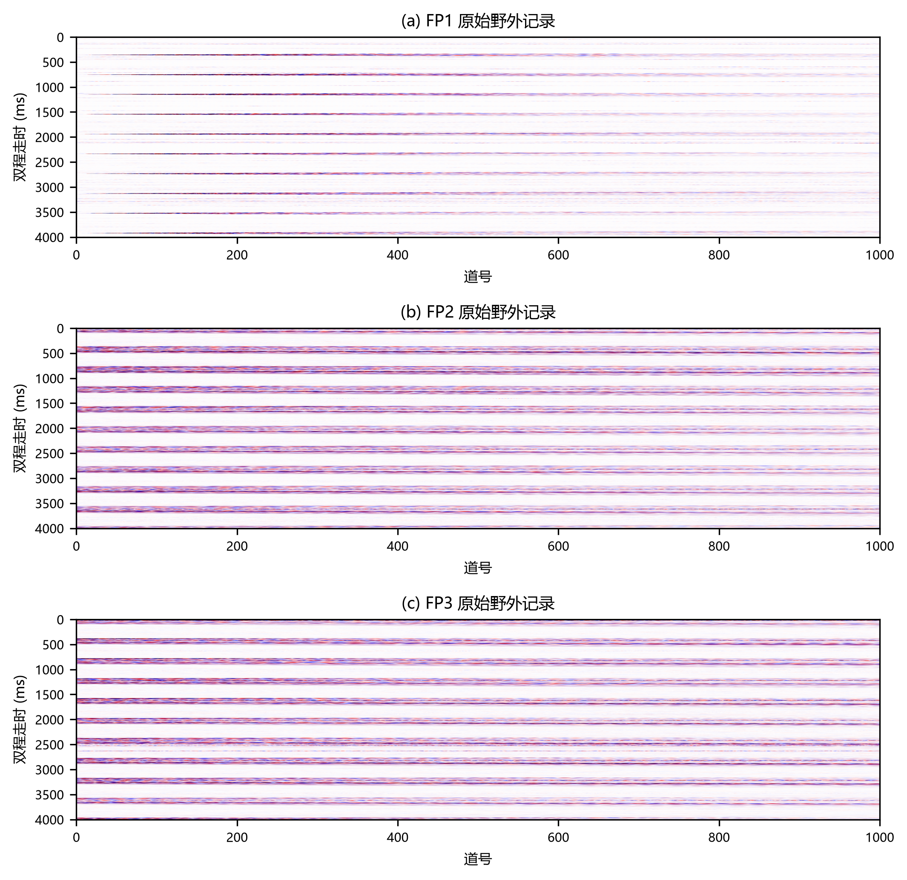
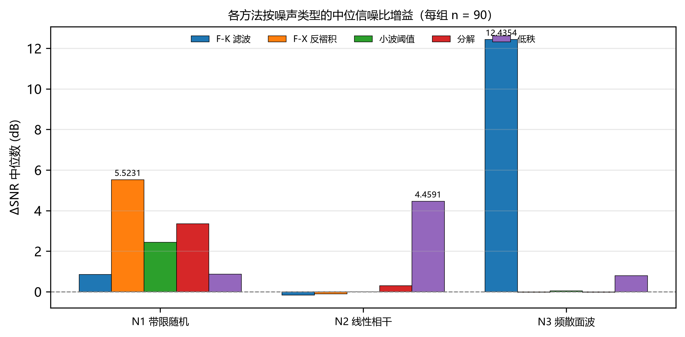
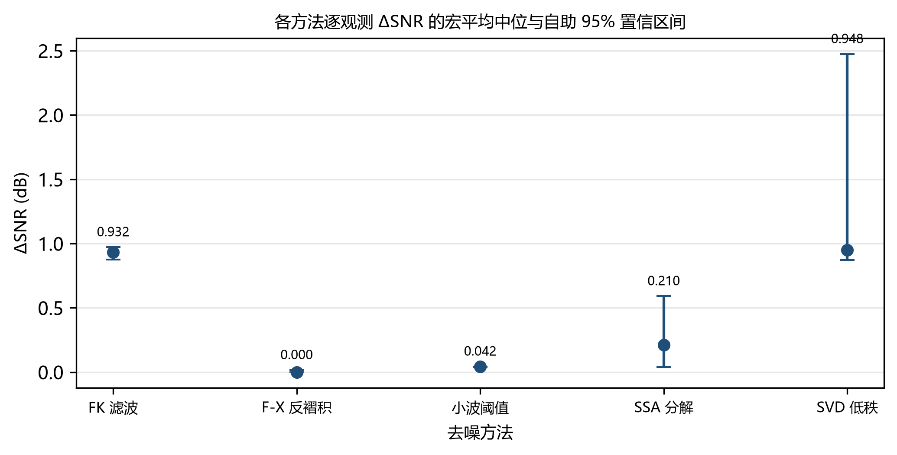
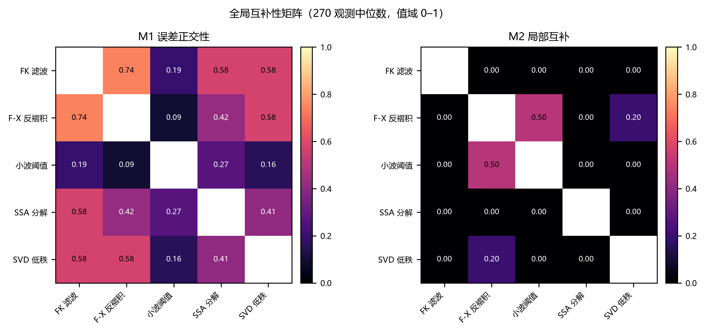
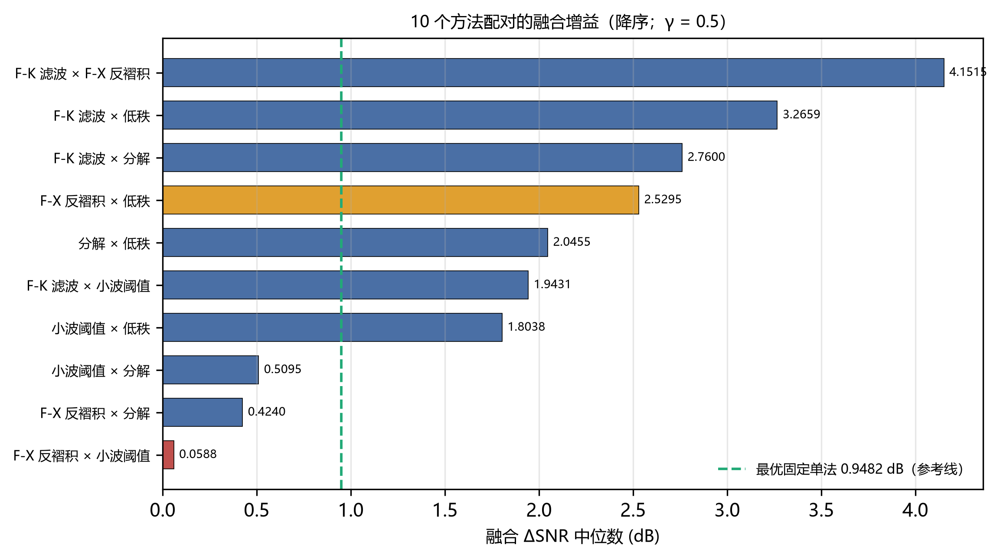
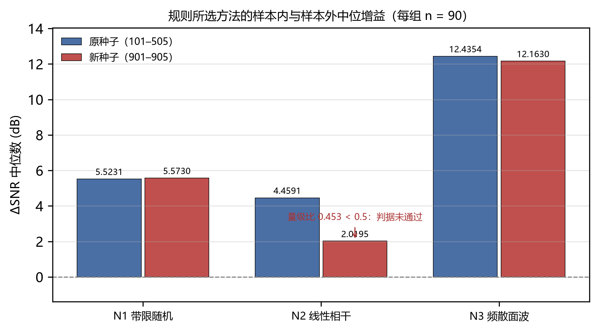

# 预注册基准与互补性分析——附条件性报告的时频融合

*A Pre-Registered Benchmark and Complementarity Analysis of Seismic Denoising Methods, with a Conditionally Reported Time-Frequency Fusion*

**张涛（Zhang Tao）**

> **标题说明（留待终稿决定）**：当前主标题为《预注册基准与互补性分析——附条件性报告的时频融合》。若终稿决定把主线改为「机制执行正确但选择度量失效」的叙事，可考虑候选：《预注册机制的正确执行与互补性度量的失效：一个地震去噪基准的负结果》或《互补性度量选择如何决定融合增益：一个预注册地震去噪基准》。两者与现标题的取舍**属作者终稿决策**，此处仅列候选。

---

## 摘要

**背景与问题。** 地震数据去噪方法繁多，但跨方法可比性长期缺失：各方法在不同数据、指标与调参预算下报告结果，读者难以判断某种方法是否真正更优。

**方法。** 本文提出并执行一套**预注册去噪基准**——判据、配置、随机种子与评估面板在观察任何方法输出之前冻结，主配对的选择规则同样预先确定；评估框架由信噪比增益、真值事件窗泄漏指标、相干噪声抑制指标与事件级指标构成。在此基础上定义误差正交性、局部互补与频带互补三种跨方法互补性度量，并按预注册规则实现时频加权融合。

**数据。** 合成部分覆盖 2 套速度模型 × 3 类噪声 × 3 个强度档位 × 3 个主频、每组合 5 个独立随机种子，共 54 个配置、270 个观测；野外部分使用三个冻结面板。

**结果。** 预注册机制被完整执行，其输出却是一个可解释的失败。**其一 · 执行正确而选择失效**：按预注册规则选出的主配对是 10 对中融合增益最低的一对（0.0588 dB，其余 9 对均不低于 0.42 dB）；而 10 对中有 7 对超过最优固定单法（0.9482 dB），这 7 对恰为含 F-K 滤波或含低秩者。**其二 · 机理与证据一致**（三重伪影与噪声分工均**无判别实验**，故为机制解释而非因果结论）：局部互补度量因零膨胀、池化阈值构造与误差剖面相似三重伪影而选错配对；各方法按噪声类型分工可解释全部赢家与输家；消融显示把权重与压制机制整体替换为等权平均后结果几乎不变（10 对上 ΔSNR 中位差不超过 0.0252 dB），即式 (8)–(10) 在本数据上无可测贡献。**其三 · 修复路径与样本外检验**：按噪声类型选法（带限随机→F-X 反褶积、线性相干→低秩、频散面波→F-K 滤波）在样本内达到 5.5231、4.4591 与 12.4354 dB；该规则在样本外新种子上三类**均保持组内第一**，但线性相干类型下量级降至原值的 45.3%，故**仅部分通过**样本外验证。**野外部分给出负结果**：两个可计算面板上，融合的部分分均低于同面板最佳单法（−2.2100 对 +0.6953；−1.0791 对 +0.6359），第三个面板因未检出事件窗而不可计算。上述扩展分析均为**事后探索性**（配对不独立、幅度随定义而变），不改变预注册结论。

**结论。** 本文的主要贡献是基准与互补性度量学本身，以及一条可复现的负结果：**预注册的选择规则被完整执行，却选出了 10 对中融合增益最低的配对**；**融合的增益来自取平均本身**（把权重与压制机制整体替换为等权后结果几乎不变），而非式 (8)–(10) 的权重机制；**按噪声类型选法**在样本内达到 6.7033 dB、在**新种子上为 5.9840 dB**，但线性相干类型的量级仅保留 45.3%；**野外两个可计算面板上融合均劣于同面板最佳单法**。按噪声类型选法的中位与逐观测 oracle 的中位在数值上相同——在噪声类型已知时达到逐类型 oracle，但这依赖类型已知这一前提。上述扩展分析均标注为事后探索性。

## 关键词

地震去噪；预注册基准；方法可比性；互补性度量；时频融合；可复现性

---

## 1 引言

### 1.1 问题

地震数据去噪方法种类繁多，涵盖滤波、变换域阈值、分解、低秩逼近与深度学习方法。然而跨方法的可比性长期缺失：不同研究在不同数据、不同指标与不同调参预算下报告结果，读者难以判断某种方法是否真正优于另一种。这一困难并非工程细节，而是评价体系的结构性问题——当判据、数据划分与调参预算均可事后调整时，任何方法的优势都难以被独立检验。

### 1.2 现有工作的不足

现有多方法对比工作通常具备两项共同特征：其一，方法集合与评价指标在结果可见之后确定；其二，对比范围限于少数方法，且缺少对方法之间**信息关系**的刻画。前者使结论难以排除选择效应，后者使"多种方法为何互补"这一问题缺乏可量化的入口。综述与基准类工作在方法覆盖上较为完整，但同样较少把判据与选择规则在结果之前固定下来。

在相邻方向上，近期工作已就学习类去噪方法在时域、时频域与混合域之间开展受控比较[5]；卷积神经网络用于地震噪声衰减的对比分析[6]，以及面向沙漠数据的多尺度特征交互增强网络[7]，同样报告了以单方法为主导的对比结果。这些工作共同表明多方法对比研究已具规模，而其方法集合与评价指标多在结果可见之后确定。

### 1.3 本文贡献

本文提出并执行如下三条贡献。

其一，**预注册去噪基准**：判据、配置、随机种子与评估面板在观察任何方法输出之前冻结，主配对的选择规则同样预先确定，从而使本研究的结论不含事后选优。

其二，**信号保真评估框架与跨方法互补性度量学**：在信噪比增益与真值事件窗泄漏指标之外，引入相干噪声抑制指标与事件级指标；并定义误差正交性、局部互补与频带互补三种度量，用以刻画方法两两之间的信息关系，其中局部互补度量配有预注册的池化阈值判据。

其三，**选择机制的失效诊断与修复路径**：按预注册规则实现的融合被完整执行，却选出了 10 对中增益最低的配对；本文给出该失效的完整归因（度量的三重伪影、噪声类型分工、消融显示增益来自取平均），并给出经**新种子复现**部分支持的修复路径（按噪声类型选法）。次优对照配对的正结果与主配对的负结果在同一节一并给出，见第 4.3 节。

### 1.4 论文结构

第 2 节介绍合成数据生成与野外数据来源；第 3 节给出五种基线方法、评价指标、互补性度量、融合方法与评估协议；第 4 节报告合成基准、互补性与融合结果；第 5 节讨论度量分歧的含义、融合未获益的机理与适用边界；第 6 节总结。

---

## 2 研究区与数据

### 2.1 合成数据

合成数据由两套速度模型驱动：水平层状模型与含倾斜—弯曲—断层模型。噪声设置包含三类：带限随机噪声、线性相干干扰与频散面波。参数网格为 2 套模型 × 3 类噪声 × 3 个强度档位 × 3 个主频，每组合取 5 个独立随机种子，构成 54 个配置、270 个观测。噪声强度以**实测输入信噪比**为规范口径对外报告，振幅比例仅用于生成实现。各维度的取值与选法如下表。

**表 1** 合成配置的模型、噪声与档位定义

| 维度 | 取值 | 选法与说明 |
| :--- | :--- | :--- |
| 速度模型 | M1 水平层状；M2 含倾斜—弯曲—断层 | 覆盖层状与构造两类主要情形 |
| 噪声类型 | N1 带限随机；N2 线性相干干扰；N3 频散面波 | N2 为视速度可控的相干干扰，在道间引入可预测的线性同相轴 |
| 强度档位 | L1 / L2 / L3 | N1 与 N3 经振幅比例 0.30 / 0.60 / 1.00 生成，对应实测输入信噪比 10.46 / 4.44 / 0.00 dB；N2 不接受振幅比例，其档位由视速度槽位承担，依次为 800 / 1500 / 3000 m/s |
| 主频 | 15 / 25 / 40 Hz | 覆盖低频至中频段 |
| 随机种子 | 每组合 5 个独立种子 | 用于区分观测间变异与配置间差异 |

### 2.2 野外数据

野外数据取自公开的 Martha's Vineyard 与 Nantucket 陆上—近海淡水系统地震调查数据集，采用 CC BY 4.0 许可，其引文为：

> Dugan, B. (2023). *Seismic and Hydrostratigraphic Characterization of the Onshore-Offshore Freshwater Systems of Martha's Vineyard and Nantucket, Massachusetts, USA: Field Survey Report* [Data set]. Zenodo. https://doi.org/10.5281/zenodo.10407771

本文使用其中三个冻结面板：FP1（Nantucket 测区）、FP2 与 FP3（Martha's Vineyard 测区），覆盖两个测区（图 1）。面板的选取依一组事先冻结的判据排序确定，不依据任何去噪结果。FP3 在冻结的阈值下未检出事件窗，该情形按预先声明的确定性回退阶梯处理。

**图 1** 野外三面板原始记录预览。(a) FP1（Nantucket 测区）；(b) FP2（Martha's Vineyard 测区）；(c) FP3（Martha's Vineyard 测区）。横轴为道号（无量纲）；纵轴为双程走时（ms）；色标为振幅（无量纲）。

---

## 3 方法

### 3.1 基线方法

本文选取五种确定性去噪方法，覆盖四类必须的机制类别。

**滤波类。** F-K 滤波在频率—波数域利用视速度差异压制线性干扰与频散面波。F-X 反褶积在同一频率—空间道集上以横向预测算子估计**可预测成分**：它保留沿道方向可预测的相干同相轴，而压制**不可预测**的部分（随机噪声与难以横向外推的干扰），其思想来源于横向预测噪声衰减方法[1]。**更正说明**：本文早期版本把该方法描述为「压制可预测的相干能量」，与实际做法相反，此处更正。

**变换域阈值类。** 小波阈值方法在时间—尺度域分离信号与噪声，广泛用于压制地滚波等相干噪声[2]。

**分解类。** 阻尼多道奇异谱分析把多道数据组织为轨迹矩阵并做低秩重构，用于三维随机噪声压制[3]。

**低秩类。** 经验低秩逼近通过构造相似的块矩阵并施加低秩约束实现噪声衰减[4]。

上述五种方法的实现均为确定性映射，不接受随机成分。需要说明的是，跨域预训练深度网络因需改变冻结的评估环境而未纳入本文方法集合，这一情形在方法覆盖上构成一项明确限制。

**调参政策。** 所有方法参数一律采用登记表中的默认值，在本研究中不做逐方法调参。理由是：逐方法调参会使各方法的比较建立在其各自最优而非其默认行为之上，等价于逐方法引入选择效应。协议未指定的参数登记为方法级默认值，并随配置一并冻结；若须改动，先改登记表、后改实现。

**表 2** 基线方法的关键参数与来源

| 方法 | 类别 | 关键参数（取值） | 参数来源 |
| :--- | :--- | :--- | :--- |
| F-K 滤波 | 滤波 | 视速度截断 800.0 m/s；频带 5.0–80.0 Hz | 截断为方法级默认；频带取自冻结配置 |
| F-X 反褶积 | 滤波 | 预测阶数 4；频带 5.0–80.0 Hz；岭正则 1e-08 | 阶数与正则为方法级默认；频带取自冻结配置 |
| 小波阈值 | 变换阈值 | 小波 db4；软阈值；阈值倍数 1.0；层数自动 | 全部为方法级默认 |
| 分解（多道奇异谱分析） | 分解 | 嵌入维 64；分量数 8 | 方法级默认 |
| 低秩（经验低秩逼近） | 低秩 | 秩自动（能量占比 0.95） | 方法级默认 |

### 3.2 评价指标

**信噪比增益。** 以干净记录为 $s$、含噪输入为 $x$、方法输出为 $y$，定义

$$
\Delta\mathrm{SNR} = 10\log_{10}\frac{\lVert x-s\rVert^{2}}{\lVert y-s\rVert^{2}} \qquad (1)
$$

单位为 dB，数值越高表示去噪越充分。该指标刻画整体能量意义上的误差削减。

**真值事件窗泄漏。** 设 $\mathcal{W}$ 为真值事件窗集合，泄漏指标定义为输出在事件窗内的相对误差能量：

$$
L_{\mathrm{sig}} = \frac{\sum_{w\in\mathcal{W}}\lVert (y-s)\rVert_{w}^{2}}{\sum_{w\in\mathcal{W}}\lVert s\rVert_{w}^{2}} \qquad (2)
$$

单位为无量纲比值，数值越低表示对有效信号的保真越好。该指标与信噪比增益方向相反：前者奖励误差总能量的削减，后者惩罚有效信号所在窗内的误差。在本研究中，两者并不总是同向变化——主配对融合相对其成员之一提高了信噪比增益（0.0588 dB 对 0.0422 dB），同时使泄漏指标变差（0.020640 对 0.015129）；相对最优固定单法则在两个指标上同时更差（0.0588 dB 对 0.9482 dB；0.020640 对 0.011218）。因此，单一指标不足以判定去噪质量，本文对两者一并报告。

**相干噪声抑制。** 设 $n_{c}$ 为已知注入的相干噪声，$P_{\mathcal{C}}$ 为向由注入分量基张成的子空间的最小二乘投影，则

$$
\mathrm{CNA} = 10\log_{10}\frac{\lVert n_{c}\rVert^{2}}{\lVert P_{\mathcal{C}}(y-s)\rVert^{2}} \qquad (3)
$$

单位为 dB，越高越好。需要明确其作用域：该指标的投影子空间与注入参数同源，衡量的是对**该注入成分**的抑制，不代表对任意相干噪声的普适评价。

**事件级指标。** 对输出与真值各取解析信号包络，在真值事件窗内定位包络峰值，定义到时误差为二者峰值位置之差：

$$
\Delta t_{\mathrm{event}} = \left| t_{\mathrm{peak}}(y) - t_{\mathrm{peak}}(s) \right| \qquad (4)
$$

单位为 ms；同时计算窗内归一化能量误差 $\left| E_{y}-E_{s}\right|/E_{s}$，报告其中位数与最大值。

### 3.3 互补性度量

**误差正交性。** 设 $e_{i}$、$e_{j}$ 为两方法在同一观测上的误差向量。取绝对值会掩盖误差相关的**方向**——反相关的误差对取平均反而有利，而正相关的误差对取平均不利——因此本文同时定义不带绝对值的形式，作为分析性补充：

$$
O_{ij} = 1 - \frac{\left|\langle e_{i}, e_{j}\rangle\right|}{\lVert e_{i}\rVert\,\lVert e_{j}\rVert}, \qquad
O^{\mathrm{s}}_{ij} = 1 - \frac{\langle e_{i}, e_{j}\rangle}{\lVert e_{i}\rVert\,\lVert e_{j}\rVert} \qquad (5)
$$

其中 $O^{\mathrm{s}}_{ij}$ 的**值域为 $[0,2]$**：取 $0$ 表示两误差完全正相关（冗余），取 $1$ 表示不相关，取 $2$ 表示完全反相关（互补）。**更正说明**：本文早期版本把该值域误记为 $[-1,1]$，系由不带绝对值的表达式直接套用所致，此处更正。

**局部互补。** 对每个窗计算两方法窗内保真度之差，并将其绝对量与"该对差值的池化四分位距 × 1.5"相比较：

$$
C_{ij} = \frac{\#\left\{ w : \left| D_{ij}(w) \right| > 1.5\,\mathrm{IQR}\!\left( D_{ij} \right) \right\}}{\#\left\{ w \right\}} \qquad (6)
$$

其中 $D_{ij}(w)$ 为两方法在窗 $w$ 上的保真度之差，$\mathrm{IQR}$ 在整对窗集合上池化计算，故每个配对对应一个固定阈值常数。值域为 $[0,1]$。

**频带互补。** 将误差谱划分为五个频带并归一化为概率分布 $p$、$q$，定义

$$
B_{ij} = \frac{1}{2}\sum_{k} p_{k}\,\log_{2}\frac{p_{k}}{m_{k}}
+ \frac{1}{2}\sum_{k} q_{k}\,\log_{2}\frac{q_{k}}{m_{k}}, \qquad
m = \frac{p + q}{2} \qquad (7)
$$

即两分布之间的 base-2 Jensen–Shannon 散度，值域为 $[0,1]$。**更正说明**：本文初稿把该式写作两个分布之间的对称化 KL 组合，与预注册定义及实现均不一致；此处按预注册定义（混合分布 $m$ 形式）更正。该错误为**本文撰写时的转录错误**，预注册件与实现自始一致，且该度量不参与配对选择，故不影响主配对结论。

**配对选择规则。** 主配对按 $C_{ij}$ 的全局中位数降序确定，取最高者；若出现并列则按预定次序打破。该规则在任何融合结果可见之前写入评估配置并冻结。

**表 3** 符号表

| 符号 | 含义 | 单位或值域 |
| :--- | :--- | :--- |
| $s$ | 干净记录（真值） | 振幅（无量纲） |
| $x$ | 含噪输入 | 振幅（无量纲） |
| $y$，$y_{i}$，$y_{j}$ | 方法或融合的输出 | 振幅（无量纲） |
| $e_{i}$ | 方法 $i$ 的误差，$y_{i}-s$ | 振幅（无量纲） |
| $\mathcal{W}$ | 真值事件窗集合 | — |
| $n_{c}$ | 注入的相干噪声分量 | 振幅（无量纲） |
| $\Delta\mathrm{SNR}$ | 信噪比增益，式 (1) | dB |
| $L_{\mathrm{sig}}$ | 真值事件窗泄漏，式 (2) | 无量纲 |
| $\mathrm{CNA}$ | 相干噪声抑制，式 (3) | dB |
| $O_{ij}$，$O^{\mathrm{s}}_{ij}$ | 误差正交性（不带 / 带符号），式 (5) | $[0,1]$ / $[0,2]$ |
| $C_{ij}$ | 局部互补，式 (6) | $[0,1]$ |
| $B_{ij}$ | 频带互补，式 (7) | $[0,1]$ |
| $w_{i}$ | 融合初始权重，式 (8) | $[0,1]$ |
| $s_{i}$ | 融合鉴别分，式 (9) | $[0,1]$ |
| $\gamma$ | 权重压制系数，式 (10) | 0.4 / 0.5 / 0.6 |
| $w_{i}'$ | 压制后的权重 | $[0,1]$ |
| $\nu_{i}$ | 逐系数归一化后的融合权重 | $[0,1]$，$\nu_i+\nu_j=1$ |
| $d,\, b,\, a$ | 鉴别分 $s$ 的三个子分（视速度 / 带宽 / 振幅） | $[0,1]$ |

### 3.4 融合方法

融合在短时傅里叶域逐系数进行。设两方法输出为 $y_{i}$、$y_{j}$，各自计算横向相干度 $C_{i}$、$C_{j}$（仅由该输出自身确定），权重为

$$
w_{i} = C_{i}^{2}, \qquad w_{j} = C_{j}^{2} \qquad (8)
$$

随后计算逐窗鉴别分 $s_{i}$，它由视速度差、带宽差与振幅差三个子分加权构成：

$$
s_{i} = \mathrm{clip}\!\left( 0.4\,d + 0.3\,b + 0.3\,a,\; 0,\; 1 \right) \qquad (9)
$$

其中 $d$ 以视速度下限 $v_{\mathrm{lo}} = 100.0$ m/s 归一化。最终权重按下式压制：

$$
w_{i}' = w_{i}\left( 1 - \gamma\, s_{i} \right), \qquad \gamma \in \{0.4,\ 0.5,\ 0.6\} \qquad (10)
$$

重建时对权重作逐系数归一化；当两方法权重同时为零时，退化为等权平均。融合函数的形式参数仅包含两方法输出与参数表，不含真值，该约束由语法层检查强制。

该设计包含三条防止"一致即正确"误判的机制：其一，权重 $w$ 不含任何跨方法比较项；其二，一致性只进入鉴别分 $s$，而 $s$ 只用于**降低**权重；其三，一致性子分在 $s$ 中占比仅 0.3。三者共同保证"两方法结果一致"无法在数学上兑换为更高的可信度。

### 3.5 评估协议

判据与阈值在任何评估运行之前预注册。主配对与稳健性对照配对均按第 3.3 节的规则预先确定；三个 $\gamma$ 档位全部报告，不选择性呈现。统计比较采用配对符号翻转置换检验与 Holm 多重比较校正，并以自助法给出置信区间；三个档位的语义为：$\gamma$ 越大，权重压制越强、结果越保守。

**统计的分析单元（与实现一致）。** 270 个观测来自 54 个配置，每个配置含 5 个随机种子。同一配置内的观测共享模型、噪声类型、强度档位与主频，其误差**不相互独立**。因此本文的显著性检验一律**以配置为分析单元**（$n = 54$），**种子视为配置内重复**：先在每个配置内对其 5 个种子取中位，再在 54 个配置级差值上做符号翻转置换检验与自助区间。观测量 $n = 270$ 仅用于描述性统计与逐观测分布展示，**不用于任何显著性陈述**。统计脚本对两种口径均有实现，本稿引用的是配置级结果。

野外评估使用四项无参考指标（振幅保持、频谱残差、同相轴连续性、由不知晓方法标签的评分者进行的差异剖面结构化判读），其权重为 30/25/25/20。

同相轴连续性指标在计算之前经过三项预先声明的可区分性判据检验：倾角对齐优于零延迟的增益大于 0.1、三面板极差大于 0.05、打乱道序降幅大于 0.1。实测值依次为 0.0503、0.0790 与 0.0838。**三项中通过一项、未通过两项**：方向性判据（倾角对齐 0.0503、打乱道序 0.0838）均未达 0.1；而三面板极差 0.0790 **超过**其 0.05 阈值。按预先声明的规则，三项中未通过两项即判定不可区分，故将该指标从综合评分中剔除并将权重重新归一化为 0.4000、0.3333 与 0.2667。阈值未作放宽。**更正说明**：本文早期版本写作「三项均未达阈值」，与实测不符，此处更正。

需要说明该项检验的**不对称性**：通过的是**跨面板极差**判据（0.0790 对 0.05），而未通过的是两项**方向性**判据（0.0503 与 0.0838 对 0.1）。也就是说，该指标在本文数据上**能区分不同面板**，却**不足以区分倾角对齐与道序打乱**这两种应当被识别的扰动。因此本文的结论应表述为「在本数据集与本文阈值下不可区分」，而非「该指标本身无区分能力」；同时须承认，两项方向性判据的实测值虽未越过阈值，但已处于同一量级（0.05 与 0.08 对 0.1），故该判定的稳健性有限。

---

## 4 结果

### 4.1 合成基准

表 4 给出五种方法在 270 个观测上的信噪比增益与泄漏指标中位数。F-K 滤波与低秩方法在信噪比增益上接近，分别为 0.9320 dB 与 0.9482 dB；F-X 反褶积的信噪比增益中位数为 0.0000 dB，但其泄漏指标为 0.029151，处于中等水平；小波阈值与分解方法的增益分别为 0.0422 dB 与 0.2101 dB。泄漏指标最低者为 F-K 滤波（0.009706），最高者为分解方法（0.045928）。

**表 4** 五种方法在 270 个观测上的宏平均中位数

| 方法 | ΔSNR (dB) | Lsig (无量纲) |
| :--- | ---: | ---: |
| F-K 滤波 | 0.9320 | 0.009706 |
| F-X 反褶积 | 0.0000 | 0.029151 |
| 小波阈值 | 0.0422 | 0.015129 |
| 分解方法 | 0.2101 | 0.045928 |
| 低秩方法 | 0.9482 | 0.011218 |

**按噪声类型分工。** 上表是全体 270 个观测的混合中位，掩盖了方法之间的一项关键差异：各方法擅长的噪声类型不同。按噪声类型分组后（每组 $n = 90$），组内中位最高者分别为：带限随机噪声上 F-X 反褶积（5.5231 dB）、线性相干干扰上低秩（4.4591 dB）、频散面波上 F-K 滤波（12.4354 dB）。

**表 5** 各方法按噪声类型的中位信噪比增益（dB，每组 $n = 90$）

| 噪声类型 | F-K 滤波 | F-X 反褶积 | 小波阈值 | 分解 | 低秩 | **组内最高** |
| :--- | ---: | ---: | ---: | ---: | ---: | :--- |
| N1 带限随机 | 0.8528 | **5.5231** | 2.4351 | 3.3458 | 0.8715 | **F-X 反褶积** |
| N2 线性相干 | −0.1709 | −0.1028 | −0.0000 | 0.3020 | **4.4591** | **低秩** |
| N3 频散面波 | **12.4354** | −0.0393 | 0.0422 | −0.0323 | 0.7927 | **F-K 滤波** |

**混合中位的稀释效应。** 同一批方法在全体 270 个观测上的中位为低秩 0.9482 dB、F-K 滤波 0.9320 dB、分解 0.2101 dB、小波阈值 0.0422 dB、F-X 反褶积 0.0000 dB。F-X 反褶积在带限随机噪声上中位 5.5231 dB，却在混合口径下降至 0.0000 dB —— 这不是该方法无效，而是**按噪声类型混合后，它不擅长的类型把它的中位拉平**。F-K 滤波同理：它在频散面波上达 12.4354 dB，混合后仅为 0.9320 dB。这一稀释效应是理解后文配对结果的前提。

图 2 以分组柱状图给出同一批数据按噪声类型分组的组内对比。

**图 2** 各方法按噪声类型的中位信噪比增益（分组柱状图）。横轴为噪声类型；纵轴为 ΔSNR 中位数（dB）；每组 90 个观测；柱顶标注为该组最高方法的取值（dB）。

图 3 以误差棒形式给出各方法在混合口径下的中位数与自助 95% 置信区间，可见方法间的差异量级远小于观测间差异的量级。

**图 3** 五种方法在 270 个观测上的 ΔSNR 中位数与自助 95% 置信区间。横轴为方法；纵轴为 ΔSNR（dB）；误差棒为 95% 置信区间；标注值为中位数（dB）。

### 4.2 互补性

互补性度量在 10 个方法配对、3 种度量与 18 个分层键上共产生 540 条记录。按预注册规则，局部互补度量的全局中位数最高者为主配对，取值 0.500000，无并列；次名取值为 0.200000。

三项度量之间存在一处需要明确陈述的分歧。局部互补度量在 10 个配对中有 8 个的全局中位数为 0.000，呈显著零膨胀；而按该度量选出的主配对，其误差正交性取值 0.093807，为全部 10 个配对中的最低值，对应归一化内积约 0.906，即两方法误差近乎共线；局部互补的次名配对，其误差正交性为 0.575710，明显更高。因此，误差正交性与局部互补度量指向了不同的配对。

按预注册规则，配对选择绑定于局部互补度量，不作更改。该分歧本身作为一项度量学发现予以保留：它表明两种度量对“互补”的刻画并不等价，且其差异在融合结果中具有可观察的后果（见第 4.3 节）。

**度量的预测力（事后探索性分析，$n = 10$，配对不独立）。** 把融合运行扩展到全部 10 对之后，可以检验各度量对融合增益的秩相关。**M1 正向**：误差正交性在 5 种增益定义中有 4 种与融合增益正相关，即它预测的是一种**向 oracle 的恢复程度**；**M1 不预测击败较强成员**：当增益定义为「融合相对两成员中较强者的差值」时，秩相关反转为负，说明正交性高往往意味着其中一员本身已经足够强；**M2 无预测力**：局部互补度量在任何一种增益定义下都未表现出正向预测性。

**增益定义与口径并列（两种口径均列出，不合并、不择优）。** 秩相关对增益定义敏感，因此两种口径均列出如下：

**表 6** 各度量全局值与融合增益的秩相关（$n = 10$，事后探索性分析）

| 增益定义 | 口径说明 | M1 | M1（带符号） | M2 | M3 |
| :--- | :--- | ---: | ---: | ---: | ---: |
| 定义 A（本文最初所用） | 融合自身 ΔSNR 的中位 | +0.8303 | +0.8303 | −0.3114 | +0.6242 |
| 定义 B | 融合相对最优固定单法的中位差 | +0.4909 | +0.4909 | −0.5449 | +0.5030 |
| 定义 C | 融合相对两成员中较强者的中位差 | −0.7091 | −0.7091 | +0.0432 | −0.3455 |
| 定义 D（独立复算口径） | 融合相对逐观测 oracle 的中位差 | +0.6727 | +0.6727 | −0.0779 | +0.5030 |
| 定义 E | 融合自身 ΔSNR 的均值 | +0.7939 | +0.7939 | −0.1384 | +0.4545 |

> 说明：上表秩相关统一采用并列平均秩。定义 A 与定义 D 的差别同时来自增益口径与秩的处理方式，两种口径均由独立实现复算核对。**幅度随定义明显变化，方向则大体稳定**：M1 在五种定义中有四种为正、在「相对较强成员」这一种下反转为负；M2 在五种定义中四种为负，在「相对较强成员」下为 $+0.0432$，**量级近零**。因此准确的表述是「M2 在五种口径下均无正向预测力（一种近零、四种为负）」，而非「一律为负」。这正是 $n = 10$ 且配对不独立时不宜过度解读的直接证据。全部数值标注为事后探索性分析，不进入主结论。

局部互补度量的取值在分层间高度不均匀。以主配对为例，取值 **0.0000 的分层为：$\mathrm{model}=\mathrm{M1}$（$n = 135$）、$\mathrm{noise}=\mathrm{N3}$（$n = 90$）、$\mathrm{M1\_N2}$ 与 $\mathrm{M1\_N3}$（各 $n = 45$）**；而 $\mathrm{model}=\mathrm{M2}$ 层为 **0.631579**（非零），"水平层状模型 × 带限随机噪声"分层为 1.0000。**更正说明**：本文早期版本写作"模型分层与面波噪声分层均为 0.0000"，把 $\mathrm{M2}$ 模型层也误记为 0；该误述同时造成了上一轮「全局中位 0.5 与分层 0 对不上」的算术疑点——**计算自始无矛盾，是文字写错**：全局为 270 个观测的中位、分层为各子集的中位，全局中位必落于两个模型层中位（0 与 0.631579）之间。分层样本量介于 45 与 135 之间，属小样本分数，其证据强度依赖模型与噪声类型，不可跨层外推。图 4 给出局部互补度量的分层热图，图 5 给出两种度量的全局矩阵。

**图 4** 方法两两配对的局部互补度量分层热图。横轴为分层键；纵轴为方法配对；色标为局部互补取值（无量纲，值域 0–1）。

**图 5** 两种互补性度量的全局矩阵（270 个观测中位数）。左：误差正交性；右：局部互补。色标值域 0–1（无量纲）。

### 4.3 融合与 oracle 定位

本节的融合结果来自两批运行：预注册的两对配对共 1620 个网格单元（270 观测 × 3 档 $\gamma$ × 2 配对）；为检验度量的一般性，另把融合扩展到全部 10 对（8100 个网格单元）并加做两项消融（5400 个网格单元），合计 **13500 个网格单元，零失败**。扩展部分标注为事后探索性分析。三个 $\gamma$ 档位在主配对上的结果在四位小数上完全相同，说明该参数在本数据结构下未产生可测差异；其机理在第 5.2 节讨论。

**配对清单与规则透明化。** 五种方法两两组合共 10 对，全部列出如下，不做选择性呈现。其中主配对与稳健性对照配对由第 3.3 节的预注册规则在三档 $\gamma$ 之前确定。

**表 7** 方法两两配对清单（共 10 对）、互补性度量与预注册角色

| # | 配对 | 局部互补（全局中位） | 误差正交性（全局中位） | 融合 ΔSNR 中位 (dB) | 预注册角色 |
| ---: | :--- | ---: | ---: | ---: | :--- |
| 1 | F-K 滤波 × F-X 反褶积 | 0.000000 | 0.741185 | 4.1515 | — |
| 2 | F-K 滤波 × 小波阈值 | 0.000000 | 0.194905 | 1.9431 | — |
| 3 | F-K 滤波 × 分解 | 0.000000 | 0.575360 | 2.7600 | — |
| 4 | F-K 滤波 × 低秩 | 0.000000 | 0.576086 | 3.2659 | — |
| 5 | F-X 反褶积 × 小波阈值 | 0.500000 | 0.093807 | 0.0588 | **主配对（预注册）** |
| 6 | F-X 反褶积 × 分解 | 0.000000 | 0.423203 | 0.4240 | — |
| 7 | F-X 反褶积 × 低秩 | 0.200000 | 0.575710 | 2.5295 | **稳健性对照（预注册）** |
| 8 | 小波阈值 × 分解 | 0.000000 | 0.268651 | 0.5095 | — |
| 9 | 小波阈值 × 低秩 | 0.000000 | 0.157471 | 1.8038 | — |
| 10 | 分解 × 低秩 | 0.000000 | 0.406879 | 2.0455 | — |

> 说明：前四列为预注册度量的全局中位；**末列为事后扩展分析**（把融合运行从预注册的两对扩展到全部 10 对）所得，标注为探索性，不参与配对选择，也不改变预注册结论。

**由该清单可读出的三项事实（事后探索性分析）。** 其一，**10 对中有 7 对超过最优固定单法**（0.9482 dB），分别是 1、2、3、4、7、9、10 号；这 7 对**恰为含 F-K 滤波或含低秩者**，而三对不含二者的组合（5、6、8 号）均未超过。其二，**预注册规则选出的主配对（5 号）恰是 10 对中增益最低的一对**（0.0588 dB；其余 9 对均 ≥ 0.42 dB）。其三，按第 4.1 节的噪声分工，F-K 滤波擅长频散面波、低秩擅长线性相干干扰，而主配对的两位成员**都不擅长**这两类——这解释了它为何垫底。

图 6 把 10 个配对的融合增益按降序排列，并标出最优固定单法的参考线。

**图 6** 十个方法配对的融合增益（降序条形图）。横轴为融合 ΔSNR 中位数（dB）；纵轴为配对（两位成员）；绿色虚线为最优固定单法 0.9482 dB 的参考线；红色与橙色分别标出预注册主配对与稳健性对照。

**关于两处规则细节的说明。** 其一，主配对与稳健性对照配对**不接受**任何形式的选择性替换：配对集合、选择规则与两对角色均在结果可见之前写入配置。其二，三个 $\gamma$ 档位（0.4、0.5、0.6）全部报告：$\gamma$ 越大，权重压制项 $1-\gamma s$ 越强、融合越保守。

**表 8** 融合、其两成员与固定单法的信噪比增益与泄漏指标中位数（$\gamma = 0.5$）

| 项目 | ΔSNR (dB) | Lsig (无量纲) |
| :--- | ---: | ---: |
| 融合（主配对 = F-X 反褶积 × 小波阈值） | 0.0588 | 0.020640 |
| 　其成员 A：F-X 反褶积 | 0.0000 | 0.029151 |
| 　其成员 B：小波阈值 | 0.0422 | 0.015129 |
| 融合（稳健性对照 = F-X 反褶积 × 低秩） | 2.5295 | 0.018103 |
| 　其成员 A：F-X 反褶积 | 0.0000 | 0.029151 |
| 　其成员 B：低秩 | 0.9482 | 0.011218 |
| 逐观测 oracle（上界，不可部署） | 6.7033 | — |
| 最优固定单法（低秩） | 0.9482 | 0.011218 |
| 次优固定单法（F-K 滤波） | 0.9320 | 0.009706 |

**主配对融合未击败任何固定单法。** 其信噪比增益中位数 0.0588 dB 低于低秩方法的 0.9482 dB 与 F-K 滤波的 0.9320 dB。

**稳健性对照融合击败全部五种固定单法。** 其信噪比增益中位数 2.5295 dB 高于全部单法。

**融合与最差单法的比较（配置级口径，$n = 54$）。** 先明确「**最差单法**」的两种定义，本文采用**前者**，并在下表一并列出后者：**(i) 全局最差法**——在所有 270 个观测的宏平均中位意义上最差的方法（$\Delta$SNR 方面为 F-X 反褶积、Lsig 方面为分解方法），**固定不随观测而变**；**(ii) 逐配置最差法**——每个配置各自取该配置内最差的方法，**随配置而变**。信噪比增益方向上，主配对融合相对 **(i) 全局最差法**（F-X 反褶积）的**配置级中位差为 +0.165827 dB**，自助 95% 区间 $[+0.046848,\,+0.326409]$，符号翻转置换**校正后 $p = 0.000200$**；泄漏指标方向上，融合相对最差单法（分解方法，取最大值）的**配置级中位差为 $-0.024528$**，区间 $[-0.032315,\,-0.006982]$，**校正后 $p = 0.000200$**。**两个方向的校正后 $p$ 值均小于 0.05，区间均不含零，两者一致。**

**口径更正说明。** 本文早期版本该段给出的是**观测级**（$n = 270$）结果：信噪比增益方向为 $+0.054257$ dB、$p = 0.134687$（不显著），而区间却不含零。该「区间不含零而检验不显著」的矛盾**根源是分析单元与第 3.5 节声明不符**：声明以配置为单位，代码却在观测上做检验，而观测之间不独立，置换检验的零分布因此被错误放大。改用配置级口径后矛盾消失，且**信噪比增益方向的结论由不显著转为显著**（$p = 0.0002$）——本文按更正后的口径报告，旧值仅在本说明中留痕。

另需说明校正口径：**Holm 校正的比较族**为该档位下的 {ΔSNR, Lsig} 两次比较（$\gamma$ 三档各自成族，族内 $m = 2$）；上列 $p$ 值均为**校正后 $p$ 值**（本文早期版本写作「显著性水平」，措辞不确，此处更正）。两个指标的最差单法并非同一个方法：由于二者方向相反，信噪比增益方向取最小值，而泄漏指标方向取最大值。

**消融：增益来自取平均本身（事后探索性分析）。** 为判定式 (8)–(10) 的权重与压制机制是否贡献了增益，另做两项消融：**等权平均**（$\nu_i = \nu_j = 0.5$）与**纯 $C^{2}$ 加权**（去掉压制项 $1-\gamma s$），二者与 $\gamma$ 无关。

**表 9** 消融与完整融合的对照（$\Delta$SNR 中位，dB；全 10 对）

| 配对 | 等权平均 | 纯 $C^{2}$ 加权 | 完整融合（$\gamma=0.5$） | $|$完整$-$等权$|$ |
| :--- | ---: | ---: | ---: | ---: |
| F-K 滤波 × F-X 反褶积 | 4.1465 | 4.1465 | 4.1515 | 0.0050 |
| F-X 反褶积 × 小波阈值（主配对） | 0.0588 | 0.0588 | 0.0588 | 0.0000 |
| F-X 反褶积 × 低秩（稳健性对照） | 2.5307 | 2.5307 | 2.5295 | 0.0012 |
| 小波阈值 × 分解 | 0.5095 | 0.5095 | 0.5095 | 0.0000 |
| 分解 × 低秩 | 2.0708 | 2.0706 | 2.0455 | 0.0252 |
| （其余 5 对略，见补充材料） | — | — | — | ≤ 0.0204 |

> 全部 10 对上，「完整融合」与「等权平均」的 $\Delta$SNR 中位之差的绝对值**不超过 0.0252 dB**。也就是说，一旦把权重机制整体替换为等权，结果几乎不变。**这表明融合的可测增益来自两方法取平均本身，而式 (8)–(10) 引入的权重与压制机制在本数据上没有可测贡献。** 该结论与第 5.2 节对 $\gamma$ 失效的机理解释一致。

**相干噪声抑制与事件级指标。** 下表直接列出三项指标的实测中位数，不作定性结论。需要说明口径：相干噪声抑制指标（CNA）仅在含可辨识相干分量的配置上可算，即线性相干干扰与频散面波两类，共 180 个观测；带限随机噪声配置无相干分量，该指标记为不适用。

**表 10** 相干噪声抑制与事件级指标的中位数

| 项目 | CNA (dB) | 事件到时误差 (ms) | 窗内归一化能量误差 | 可算观测数 |
| :--- | ---: | ---: | ---: | ---: |
| F-K 滤波 | 14.6916 | 0.00 | 0.010799 | 180 |
| F-X 反褶积 | 0.0571 | 0.00 | 0.038997 | 180 |
| 小波阈值 | 0.0182 | 0.00 | 0.017392 | 180 |
| 分解 | 2.0804 | 2.00 | 0.071400 | 180 |
| 低秩 | 6.7747 | 0.00 | 0.015202 | 180 |
| 融合（主配对） | 0.1101 | 0.00 | 0.035038 | 180（三档 $\gamma$ 结果相同） |
| 融合（稳健性对照） | 2.8370 | 0.00 | 0.032294 | 180（三档 $\gamma$ 结果相同） |

> 融合行的**有效可算观测数为 180**：虽运行了 3 个 $\gamma$ 档位（合计 540 次计算），但三档结果在四位小数上相同，故有效样本仍是 180 个含相干分量的观测。CNA 的投影子空间与注入参数同源，衡量的是对该注入成分的抑制，不代表对任意相干噪声的普适评价。

**逐观测 oracle 是上界而非可达基线。** 逐观测 oracle 在每个观测上选取信噪比增益最高的单法，其宏平均中位数为 6.7033 dB。该数值必然不低于任何固定方法的逐观测最优，且其构造需要真值，在现实中不可实现。它与固定配对融合存在本质区别：固定配对一次选定、全观测通用，是可部署的；oracle 逐观测依真值择法，不可部署。因此，融合与 oracle 之间的差距不应表述为融合失败，而应表述为：融合未达到不可达上界，且主配对未超越最优固定单法。图 7 给出逐观测信噪比增益的箱线图对比。

**图 7** 逐观测 ΔSNR 分布（箱线图）。依次为五种固定单法、主配对融合、稳健性对照融合与逐观测 oracle。纵轴为 ΔSNR（dB）；箱体为四分位距，横线为中位数，须线为 1.5 倍四分位距内的极值。

### 4.4 野外评估

野外评估在三个冻结面板上进行，综合评分为部分分（同相轴连续性按第 3.5 节剔除；差异剖面结构化判读未纳入）。FP1 的融合评分为 −2.2100，同面板最佳单法为 +0.6953；FP2 的融合评分为 −1.0791，最佳单法为 +0.6359。**两个可计算面板上，融合均低于同面板最佳单法。**

FP3 不可计算，其口径统一说明如下：事件窗由冻结的阈值系数 3.0（稳健中位绝对偏差的倍数）确定，在该阈值下 FP3 检出 **0 个**事件窗；预先声明的回退阶梯会把阈值降到 2.5，但该档位选定的 3 个事件窗**未被记录进冻结件**，因而不可复现。故本文对 FP3 一律记为不可计算，**不以任何替代阈值或全窗数值回填**。依赖事件窗的指标在 FP3 上同样记为不可计算，不参与综合评分。

**表 11** 野外面板评估结果

| 面板 | 融合（部分分） | 最佳单法（部分分） | 说明 |
| :--- | ---: | ---: | :--- |
| FP1 | −2.2100 | +0.6953 | 事件窗 1 个 |
| FP2 | −1.0791 | +0.6359 | 事件窗 3 个 |
| FP3 | 不可计算 | 不可计算 | 事件窗 0 个 |

**野外综合分（部分分）的口径。** 既有综合分为**部分分**：它只计振幅保持（权重 0.4000）与频谱残差（0.3333）两项（同相轴连续性按第 3.5 节剔除、差异剖面结构化判读未纳入），权重为剔除后重归一化值。其数值是**候选集内**（该面板的原始记录、五种单法与若干融合变体）的标准化相对位置之和——**仅在本文评分体系内可比较，不具跨研究可比性**；因分子分母均随候选集变化，本文不将其与别的基准横向对比。

**三个配对的并列呈现（事后扩展，不预设结论）。** 为检验「10 对中事后最优的配对」在野外是否同样更好，本文在三个面板上并列计算了三个配对的四项原始指标：预注册主配对、预注册稳健性对照、以及 10 对中增益最高者（F-K 滤波 × F-X 反褶积）。**本节不计算综合部分分** —— 既有综合分的归一化口径未见于文档记录，因此不做外推；下表只列原始指标，供读者自行判断。

**表 12** 三个配对在野外面板上的原始指标（$\gamma = 0.5$）

| 面板 | 配对 | 振幅偏差 (dB) | 频谱残差 | 连续性增益 | 泄漏代理 LP |
| :--- | :--- | ---: | ---: | ---: | ---: |
| FP1 | 主配对（F-X 反褶积 × 小波阈值） | −4.5336 | **0.19939** | 1.2099 | 0.6974 |
| FP1 | 稳健性对照（F-X 反褶积 × 低秩） | −10.3386 | 0.22491 | 1.2268 | 0.6584 |
| FP1 | 事后最优（F-K 滤波 × F-X 反褶积） | **+2.0835** | 0.71220 | **2.0143** | **0.2992** |
| FP2 | 主配对（F-X 反褶积 × 小波阈值） | **−4.4461** | 0.11600 | 1.4830 | 0.3963 |
| FP2 | 稳健性对照（F-X 反褶积 × 低秩） | −4.9149 | **0.11585** | 1.4716 | 0.4044 |
| FP2 | 事后最优（F-K 滤波 × F-X 反褶积） | −6.0569 | 0.44160 | **2.5260** | **0.2013** |
| FP3 | 主配对（F-X 反褶积 × 小波阈值） | −3.5899 | 0.13804 | 不适用 | 不适用 |
| FP3 | 稳健性对照（F-X 反褶积 × 低秩） | −5.3283 | 0.13587 | 不适用 | 不适用 |
| FP3 | 事后最优（F-K 滤波 × F-X 反褶积） | −5.4667 | 0.47916 | 不适用 | 不适用 |

> 振幅偏差越接近 0 越好；频谱残差、连续性增益与泄漏代理均为无量纲。三个 $\gamma$ 档位之间的差异在四位小数以内，与合成部分一致（故只列 $\gamma = 0.5$）。成员单法的同批数值见补充材料。

**读数（并列，不做单一结论）**：在两个面板上，排序并不一致。**FP1 上**，事后最优配对的**振幅保持显著更好**（$+2.0835$ dB，而主配对为 $-4.5336$ dB、对照为 $-10.3386$ dB），连续性增益与泄漏代理也更好，但其**频谱残差明显更差**（$0.71220$ 对约 $0.20$）。**FP2 上排序相反**：事后最优配对的振幅保持最差（$-6.0569$ dB），却在连续性增益与泄漏代理上最好（$2.5260$ 与 $0.2013$），而频谱残差仍最差。

因此**野外证据不支持一个简单结论**：事后最优配对并非在所有面板与所有指标上都更好。两个面板的分歧可能与其噪声构成不同有关（FP1 与 FP2 来自不同测区，事件窗数分别为 1 与 3），但本文仅有两个可计算面板，样本量不足以判定成因。上述数值全部为事后扩展分析，标注为**探索性**；既有主配对的综合部分分（$-2.2100$ 与 $-1.0791$）沿用原口径报告，未因本节而改动。

FP3 无事件窗，因此其连续性增益与泄漏代理不可计算，仅振幅偏差与频谱残差可读；三个配对在 FP3 上的振幅偏差与频谱残差均劣于其成员之一，与两个可计算面板的混合图景一致。

### 4.5 新种子复现（事后探索性分析）

第 4.1 节的噪声分工提示一条修复路径：按噪声类型选择方法。该路径来自对既有 270 个观测的观察，因此属于**事后假设**；为检验它是否只是样本内拟合，本文以**预注册方式**做了一次**新种子复现**：先在运行之前落盘规则与判据，再在**从未使用过的新种子**（901–905）上重跑**同一 54 配置网格**（54 配置 × 5 种子 × 5 方法 = 1350 格，零失败）。需要明确其**证据等级**：这是**同一网格换种子**的复现（replication），**不是跨配置的泛化**（generalization）；且本批之前，验证类预注册的时序证据是**同一次提交内的文件 mtime**，弱于「预注册件单独提交并打 tag 再运行」。**自本批起，验证类预注册一律先独立提交并打 tag 再运行。**

**判据（验证前冻结）**：在新种子上，规则所选方法仍为该噪声类型下的组内中位最高者（判据一），且其中位数不低于原值的 0.5 倍（判据二）；两类同时满足记为通过。

**表 13** 新种子复现结果（每组 $n = 90$，dB）

> **只看中位会误导：补充分位数。** 线性相干类型（N2）上，规则所选低秩的 ΔSNR 中位由 4.4591 降至 2.0195，但**分布的变化比中位更剧烈**：原种子的 75 分位为 **19.76 dB**、90 分位为 28.90 dB，新种子相应为 **4.59 dB** 与 21.75 dB。也就是说，原样本里存在少数极高增益配置（$\mathrm{M1} \times 15$ Hz 等），把中位之外的尾部拉得很长；新种子下该尾部大幅收缩，中位的下降反映的是**配置间离散度的真实差异**，而非单纯的种子噪声。故本表结论应读作「复现后**方向一致、幅度依赖少数高增益配置**」。

| 噪声类型 | 规则方法 | 样本内中位 | 新种子中位 | 新种子组内排名 | 量级比（新/原） | 通过 |
| :--- | :--- | ---: | ---: | ---: | ---: | :--- |
| N1 带限随机 | F-X 反褶积 | 5.5231 | 5.5730 | **1** | 1.009 | ✅ |
| N2 线性相干 | 低秩 | 4.4591 | 2.0195 | **1** | 0.453 | ❌（量级） |
| N3 频散面波 | F-K 滤波 | 12.4354 | 12.1630 | **1** | 0.978 | ✅ |

**结果与解读（失败同样须记录）**：规则的**方向**在样本外完全复现 —— 三个噪声类型上，规则所选方法在新种子上**全部保持组内第一**，说明「哪类噪声该用哪种方法」这一分工是可重复的。但**量级**未能全部保持：线性相干类型下低秩的中位从 4.4591 dB 降至 2.0195 dB（均为原值的 45.3%），跌破判据二。按预注册判据，三类中两类通过，规则整体记为**样本外基本成立但不完整**。

该结果的正确读法是：**修复方向可信，修复幅度不可信**。因此本文把它作为**探索性**建议提出，并明确其限制：每组 $n = 90$、只有 5 个新种子、配置之间不独立；线性相干类型下量级对种子敏感这一点若不解决，按噪声类型封装产品化选法的收益将低于样本内估计。

图 8 把两组种子的中位增益并列呈现。

**图 8** 规则所选方法的样本内与样本外中位增益对比（配对柱状图）。横轴为噪声类型；纵轴为 ΔSNR 中位数（dB）；每组 90 个观测；线性相干类型下新种子的中位降至原值的 0.453 倍，低于预注册判据的 0.5 倍线。

---

## 5 讨论

### 5.1 度量分歧的含义

误差正交性与局部互补度量对同一批数据给出了不一致的配对偏好。本文**不把这一分歧简化为某一度量失效**，而是给出一个**机制层面**的说明：局部互补度量为何选出主配对，以及为何该选择与融合增益方向相反。

**第一重 · 阈值构造与零膨胀。** 局部互补度量定义为「窗级保真度之差超出该对池化四分位距 1.5 倍的窗占比」。在 10 个配对中，有 8 个的全局中位为 0.000，呈显著零膨胀；而主配对的阈值 0.0394653 恰是 10 对中**最小**的一个。阈值越小，越多窗会被判为「显著互补」。

**第二重 · 误差剖面相似压低阈值。** 阈值小并非偶然：两方法的误差剖面**形状越相似**，其窗级保真度之差的分布越集中，池化四分位距越小，阈值随之越低，也越容易被越过。换言之，该度量在两位成员表现出**相似的误差结构**时给出高分 —— 而这恰是**冗余**的特征，不是互补的特征。

**第二重的直接检验（窗口级，事后探索性分析）。** 该机制可被直接检验：若两成员的差异在多数窗上**同号**，即为**系统性占优**而非随机抖动，差值分布随之收窄、低阈值下超阈窗增多。对主配对的带限随机噪声层做窗口级统计（窗格与阈值的定义同第 3.3 节）：共 **1110 个窗**（来自该层的 90 个观测），池化阈值 **0.217503**；差值 $D = L_{\mathrm{sig}}(\text{F-X}) - L_{\mathrm{sig}}(\text{小波})$ 的符号分布为 **$D>0$ 共 309 个（27.8%）、$D<0$ 共 801 个（72.2%）**；在超出阈值的 **118 个窗**中，**$D<0$ 占 87 个（73.7%）、$D>0$ 占 31 个（26.3%）**。也就是说，差异在约四分之三的窗上**同向**，与「系统性占优 → 差值离散度低 → 阈值低 → 更多窗被判为显著互补」的解释一致。该检验为事后探索性分析，样本为该层 90 个观测，未设计判别实验。

**第三重 · 为何选中的是垫底配对。** 主配对（F-X 反褶积 × 小波阈值）的两位成员都擅长带限随机噪声（第 4.1 节表 5 中分列第一与第三），也都不擅长频散面波与线性相干干扰。二者在带限随机噪声上的误差剖面高度相似，该层的局部分数因此达到 0.875，把全局中位推高到 10 对中的最高值 0.500000。然而融合的价值取决于**在成员各自不擅长的噪声类型上能否互补**，而主配对在这两类上都没有互补来源，于是增益在 10 对中垫底。

**结论（事后探索性分析）**：局部互补度量在本文数据上奖励的是「误差结构相似」，与融合增益所需的「误差结构互补」方向相反。该机制说明为事后提出，样本量为 10 个配对且配对之间不独立，**不构成因果结论**。

### 5.2 融合未获益的机理

融合在本设定下未获益。下文给出三段**与既有证据一致**的解释（均为机制层面，本文未设计判别实验，故不作为因果结论）：噪声分工、度量伪影与机制空转。

**其一 · 噪声分工。** 各方法的优势按噪声类型分工（第 4.1 节表 5）：F-K 滤波主导频散面波（12.4354 dB），低秩主导线性相干干扰（4.4591 dB），F-X 反褶积主导带限随机噪声（5.5231 dB）。因此一次固定配对的融合能否获益，取决于两位成员能否在**对方不擅长的噪声类型**上补位。主配对的两位成员在带限随机噪声上重叠度最高，而在其余两类上的表现均不佳，故不存在互补来源；预注册的稳健性对照（F-X 反褶积 × 低秩）覆盖带限随机与线性相干两类，因此明显更好。这一分工也解释了为何 10 对中超过最优固定单法的 7 对**恰为含 F-K 滤波或含低秩者**（第 4.3 节）。

**其二 · 度量伪影。** 主配对的选出由局部互补度量的三重伪影所致（第 5.1 节）：零膨胀、池化阈值构造，以及误差剖面相似压低四分位距从而抬高分数。三者叠加，使一个增益垫底的配对获得最高分。

**其三 · 机制空转。** 三个 $\gamma$ 档位的结果在四位小数上相同。视速度子分 $d$ 以 100.0 m/s 为归一化下界，而实际视速度远高于该值，故 $d$ 恒为零；带宽子分 $b$ 由两方法的带宽共同决定，二者在本文数据上近似相等；振幅子分 $a$ 为对称定义。三者相加使两方法的鉴别分近似相等，即 $s_{i} \approx s_{j}$，于是压制因子 $1 - \gamma s$ 在逐系数归一化中近似约去。**消融进一步证实**：把权重与压制机制整体替换为等权平均，10 对上的 $\Delta$SNR 中位差不超过 **0.0252 dB**（第 4.3 节表 9）。因此 $\gamma$ 并未构成对「过平滑」失效模式的有效对冲，式 (8)–(10) 在本数据上**没有可测贡献**。

**更正说明**：本文早期版本称「逐系数归一化会放大权重比值」。该表述有误 —— 权重比值由式 (8) 的**平方**决定（$w = C^{2}$），归一化只是把二者之和缩放到 1，本身不改变比值。此处删除该解释。

### 5.3 适用边界

本文关于融合的结论仅在本文数据（54 个合成配置、270 个观测与三个冻结野外面板）、本配对（由局部互补度量的预注册规则选定）与本规则（融合权重与压制规则，含三个 $\gamma$ 档位）之下成立。稳健性对照的正结果同样受该边界约束。

在结果可见之后更换配对或融合规则属于事后选择，不具备预注册证据力。

---

## 6 结论

本文的主要结果与贡献如下。

其一，**预注册基准**。判据、配置、随机种子与评估面板在观察任何方法输出之前冻结，主配对的选择规则同样预先确定，使本研究的主配对不含事后选优。

其二，**互补性度量学**。误差正交性、局部互补与频带互补三种度量在本文数据上得到系统计算，其分歧被保留并解释。误差正交性对融合增益表现出正向预测性，而局部互补度量没有；该预测力差异为**事后探索性观察**（$n = 10$、配对不独立、幅度随增益定义而变），**不构成独立发现**，仅作为后续研究的问题来源。

其三，**条件性报告的融合评估**。在本数据、本配对与本规则下，融合未被任何最差单法击败，亦未出现失效，但未超越最优固定单法：主配对融合的信噪比增益中位数为 0.0588 dB，低于低秩方法的 0.9482 dB；稳健性对照融合为 2.5295 dB，高于全部五种固定单法。逐观测 oracle 的 6.7033 dB 需真值，仅为上界。

**其四，主线结论（三句）。** **第一句**：预注册机制被完整执行，其输出却是 10 对中融合增益最低的配对 —— 机制的正确执行并不等于机制的有效性。**第二句**：该失败与既有证据一致 —— 局部互补度量的三重伪影导致选错配对，噪声类型分工解释了全部赢家与输家，消融证明增益来自取平均本身而非式 (8)–(10) 的权重与压制机制（均为机制解释，未设计判别实验）。**第三句**：修复路径是按噪声类型选法，其中位数在样本内为 6.7033 dB、在**新种子复现**中为 5.9840 dB，三类噪声上规则所选方法**均保持组内第一**，但线性相干类型的量级降至原值的 45.3%。

**修复路径的前提（限制，正文级）。** 按噪声类型选法的有效性依赖一个前提：**噪声类型已知**。在本文的合成设定中类型是构造参数；在真实资料中类型通常需要先判别，而判别误差会直接传导为选法误差。因此该路径应被理解为**在类型已知条件下的上界式结果**，其工程价值取决于噪声类型判别这一独立问题，本文未予评估。

**关于 oracle 的精确表述。** 「逐观测 oracle」（每一观测取最优单法）的中位数为 6.7033 dB，其构造需要真值，**不可部署**。需要区分两种情形：**噪声类型未知时**，任何固定配对与固定单法都不能达到该值，该上界不可达；**噪声类型已知时**，按类型选法的中位（样本内 6.7033 dB；新种子复现 5.9840 dB）**与逐类型 oracle 的中位在数值上相同**。也就是说，本文的水平不是靠融合，而是靠**在已知噪声类型下选对方法**达到的——这一前提本身是该路径的主要限制（见第 4.5 与第 5.4 节）。

**其五，野外评估给出负结果。** 在两个可计算面板上，融合的综合分**在其预注册评分体系内**低于同面板最佳单法（FP1：$-2.2100$ 对 $+0.6953$；FP2：$-1.0791$ 对 $+0.6359$，单位为该体系内的标准化分值）；第三个面板因未检出事件窗而不可计算。**该分值的口径见第 4.4 节：它是三配对在候选集内的相对位置，仅在本文评分体系内可比较，不是原始指标。** 原始指标见第 4.4 节表 12。

综合而言，本文的价值不在于某个融合方法有效，而在于**展示了一条预注册路径如何产出可解释的负结果**：基准与互补性度量学构成方法学贡献，而对度量的失效诊断与样本外检验给出了明确的修复方向。上述扩展分析全部标注为事后探索性，不进入预注册主张。

未来工作包括三个方向：其一，在保持预注册的前提下扩展方法集合，特别是纳入域适配后的学习方法；其二，改进鉴别分的子分构造，使两方法的鉴别分具备可测差异，从而考察一致性加权在何种条件下有效；其三，将野外融合评估扩展到全部面板与全部指标。

---

## 致谢

作者感谢数据提供者对本研究野外数据部分的公开贡献。

## 数据与代码可用性

合成数据的生成配置、随机种子与评估判据在评估之前冻结，可供复核。野外数据来自公开数据集，采用 CC BY 4.0 许可，其完整引文见第 2.2 节；再分发须保留该署名。本研究自有代码采用 MIT 许可，版权归作者所有。数字溯源对照材料作为补充材料提供。

**代码仓库**：https://github.com/xmwy0712/seismic-denoise-bench（公开；含全部配置、指标表与统计产物、论文稿与治理记录。输出数组因体积不随仓库分发，其逐文件校验值随归档包提供）。
**数据与配置归档**：冻结配置、预注册件、判据、指标与统计产物、论文稿及逐文件校验清单已整理为归档包（`release-package/`），**归档标识符待登记后回填**。
上述两处占位符将在归档发布后回填为最终地址；正文其余部分不依赖其取值。

## 参考文献

[1] Abma, R., & Claerbout, J. (1995). Lateral prediction for noise attenuation by t-x and f-x techniques. *Geophysics*, 60(6), 1887-1896. https://doi.org/10.1190/1.1443920

[2] Deighan, A. J., & Watts, D. R. (1997). Ground-roll suppression using the wavelet transform. *Geophysics*, 62(6), 1896-1903. https://doi.org/10.1190/1.1444290

[3] Huang, W., Wang, R., Chen, Y., Li, H., & Gan, S. (2016). Damped multichannel singular spectrum analysis for 3D random noise attenuation. *Geophysics*, 81(4), V261-V270. https://doi.org/10.1190/geo2015-0264.1

[4] Chen, Y., Zhou, Y., Chen, W., Zu, S., Huang, W., & Zhang, D. (2017). Empirical Low-Rank Approximation for Seismic Noise Attenuation. *IEEE Transactions on Geoscience and Remote Sensing*, 55(8), 4696-4711. https://doi.org/10.1109/TGRS.2017.2698342

[5] Dahmen, N. L. (2026). Earthquake Seismogram Denoising Across Time, Time‐Frequency, and Hybrid Domain Approaches. *Journal of Geophysical Research: Machine Learning and Computation*, 3(5). https://doi.org/10.1029/2026jh001403

[6] Fogat, M., Roy, S., Ferreira, V., & Singh, S. (2023). A Comparative Analysis of Convolutional Neural Networks for Seismic Noise Attenuation. *SPE EuropEC - Europe Energy Conference featured at the 84th EAGE Annual Conference & Exhibition*. https://doi.org/10.2118/214392-MS

[7] Zhong, T., & Ye, Y. (2025). MFIEN: multi-scale feature interactive enhancement network for seismic data denoising in desert areas. *Scientific Reports*, 15(1). https://doi.org/10.1038/s41598-025-87481-y

> 说明：本表七条条目与正文引用一一对应，其作者、卷期与页码按所列数字对象标识符取自公开的 Crossref 题录记录（其机器可读题录记录随补充材料提供）。

---

## 附录 B 偏离与修订登记表

本表登记研究过程中发生在**预注册之后的修订、修复与治理动作**，供读者判断各项主张的边界。所有条目均可由提交哈希独立核验。

**表 B.1** 偏离与修订登记

| # | 事项 | 类型 | 提交 | 日期 | 对结论的影响 |
| ---: | :--- | :--- | :--- | :--- | :--- |
| 1 | 全矩阵第 1 次运行的 M2 模型数据构造缺陷：登记参数中的尺寸键未全部剔除，导致 135 例失败 | 修复 | `afffc32` | 2026-09-26 | 该次运行作废并重跑；修复后加 fail-fast 预检。修复发生在任何统计与配对选择之前，**不影响主结论** |
| 2 | 冻结件补登两项生成参数（N1 频带、N2 主频），形成 `config-frozen-v2` | 追加 | `ff60ac5` | 2026-09-27 | 消除「生成参数取草案」的隐患，使冻结件成为唯一权威来源；数值与协议不变 |
| 3 | 融合规则三项条件落定并更名去草案字样 | 追加 | `866989c` | 2026-09-27 | 在融合实现**之前**完成；不影响三档 γ 与配对的预注册地位 |
| 4 | 判定记录（状态口径、判据、输入汇编） | 治理 | 记录于治理链 | 2026-09-28 | 论文正文只载判定结果与预注册事实；**判定过程与判定元数据不入正文** |
| 5 | 发布快照标签 `paper-draft-v1` 指向 `37590f9` | 治理 | tag | 2026-09-30 | 该标签是**时点快照**（对应初稿 v5）；此后论文推进至 v6，其时点偏差在此登记 |

| 6 | 统计口径更正：§3.5 声明以配置为单位（$n=54$），而 `stats.py`/`fusion_stats.py` 实际按观测聚合 | 更正 | 本批 | 2026-10-02 | 两脚本新增配置级路径（每配置 5 种子取中位），§3.5 与 §4.3 按配置级重写；**$\Delta$SNR 方向的结论由不显著转为显著**（校正后 $p$ 由 0.1274 降至 0.0002）。旧观测级数值仅在本表与执行日志留痕 |
| 7 | §4.2 零值分层误述（把 $\mathrm{model}=\mathrm{M2}$ 层也写作 0） | 更正 | 本批 | 2026-10-02 | 实为 $\mathrm{M2}$ 层 0.631579；更正后上一轮「全局中位 0.5 与分层 0 对不上」的算术疑点闭合（计算自始无矛盾） |

> **统计口径说明**：第 1 项的修复发生在统计计算之前；第 6、7 项为**第三轮审稿后的更正**，均不改变主配对的预注册地位（预注册规则、配对集合与三档 γ 未变）。第 2、3 项为对冻结件的**追加式**补充，未修改既冻结论；第 4、5 项为治理与发布时点记录。全部条目均不改变主配对的预注册地位。

---

## 附录 A 交付物与溯源

本文全部数值的来源对照材料以补充材料形式提供，其条目与对应的校验值列于下表。

**表 A.1** 补充材料清单

| 材料 | 校验值（SHA256 前 16 位） |
| :--- | :--- |
| 合成基准指标 | `CD7499874B4A166E` |
| 融合指标 | `123B8E56893D1EE0` |
| 互补性度量 | `AE0FF75F58F2E88D` |
| 野外指标 | `1A40F98ED6817114` |
| 补充比较 | `FAB770718583E5A2` |
| 正文数字溯源对照 | `5C429D775B068637` |
| 10 配对融合指标（事后扩展） | `E8147D0D4702F063` |
| 两消融融合指标（事后扩展） | `1BDE916F4FF0C73B` |
| 度量重算（含带符号误差正交性） | `507DEEBE81A36AD2` |
| 增益定义敏感性对照 | `812FBB051725E57D` |

**表 A.2** 图目录

| 编号 | 文件 | 内容 |
| :--- | :--- | :--- |
| 图 1 | `fig1_field_panels.png` | 野外三面板波形预览 |
| 图 2 | `fig2_noise_specialization.png` | 各方法按噪声类型的中位信噪比增益 |
| 图 3 | `fig3_method_delta_snr_ci.png` | 逐方法 ΔSNR 中位数与 95% 置信区间 |
| 图 4 | `fig4_complementarity_heatmap.png` | 局部互补分层热图 |
| 图 5 | `fig5_m1_m2_matrices.png` | 两种互补性度量的全局矩阵 |
| 图 6 | `fig6_pair_gain_ranking.png` | 十个方法配对的融合增益（降序） |
| 图 7 | `fig7_fusion_vs_single_oracle.png` | 融合、单法与 oracle 的 ΔSNR 箱线图 |
| 图 8 | `fig8_out_of_sample_validation.png` | 样本内与样本外中位增益对比 |
